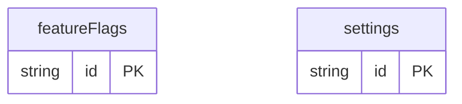

# Admin Panel Example

## What This Teaches

Use this when an app needs a small admin panel for settings and feature flags. It keeps the model lightweight and shows package API CRUD without building a full UI framework.

## Why This Shape?

- `settings` is a collection instead of one giant document because admin UIs usually edit one named setting at a time.
- `featureFlags` is separate because flags have rollout, owner, and enabled state that change independently from settings.
- The script uses the package API directly to show record management without adding a browser app.
- There are no cross-resource relations in this example; settings and flags are independent admin records.

## Data Model Diagram



## Relations To Notice

There are no schema-declared relations in this example; each resource can be inspected independently.

## Files To Inspect

- [db/featureFlags.schema.jsonc](./db/featureFlags.schema.jsonc): source data or schema for this example.
- [db/settings.schema.jsonc](./db/settings.schema.jsonc): source data or schema for this example.
- [src/admin-crud.mjs](./src/admin-crud.mjs): small runnable script for this example.
- [db.config.mjs](./db.config.mjs): example configuration for fixture discovery, outputs, and local runtime behavior.

## Run It

```bash
node ./src/cli.js sync --cwd ./examples/admin-panel
node ./examples/admin-panel/src/admin-crud.mjs
node ./src/cli.js serve --cwd ./examples/admin-panel
```

## Expected Result

The CRUD script creates a temporary flag, patches it, updates a setting, deletes the temporary flag, and prints the remaining feature flags.

## Cleanup

Generated `.db/` output is ignored by git.
