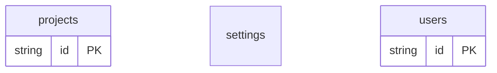

# Advanced Example

## What This Teaches

Use this after the basics when you want to see several features working together: mixed-mode fixtures, `.schema.mjs`, defaults, nested objects, and committed generated types.

## Why This Shape?

- `users.schema.mjs` uses schema helpers because it demonstrates executable schema authoring.
- `users.json` sits beside that schema as seed data, showing mixed mode where the schema is authoritative and data supplies records.
- `projects` uses nested objects and defaults to show richer contracts without adding app code.
- `settings` stays a singleton document because it represents one app-wide configuration object.
- There are no cross-resource relations in this example; it focuses on schema authoring, defaults, and mixed-mode seed data.

## Data Model Diagram



## Relations To Notice

There are no schema-declared relations in this example; each resource can be inspected independently.

## Files To Inspect

- [db/projects.schema.jsonc](./db/projects.schema.jsonc): source data or schema for this example.
- [db/settings.jsonc](./db/settings.jsonc): source data or schema for this example.
- [db/users.json](./db/users.json): source data or schema for this example.
- [db/users.schema.mjs](./db/users.schema.mjs): source data or schema for this example.
- [db.config.mjs](./db.config.mjs): example configuration for fixture discovery, outputs, and local runtime behavior.

## Run It

```bash
node ./src/cli.js sync --cwd ./examples/advanced
node ./src/cli.js serve --cwd ./examples/advanced
```

## Expected Result

`sync` loads mixed data and schema sources, applies defaults in the selected runtime store, and writes committed generated types.

## REST Request To Try

Leave `serve` running and run this from another terminal:

```bash
curl 'http://127.0.0.1:7331/db/projects.json?select=id,name,status,metadata'
```

## Features To Notice

- [JavaScript schema sources](../../docs/fixtures-and-schemas.md#javascript-schema-sources)
- [Schema defaults](../../docs/configuration.md#schema-defaults)
- [Fixture-like `.json` REST routes](../../docs/server-and-viewer.md#fixture-like-json-routes)
- [Generated types](../../docs/generated-files.md#generated-types)

## Cleanup

Generated `.db/` output is ignored by git and can be removed whenever you want fresh runtime state.

## More Docs

- [Fixtures And Schemas](../../docs/fixtures-and-schemas.md)
- [Package API](../../docs/package-api.md)
