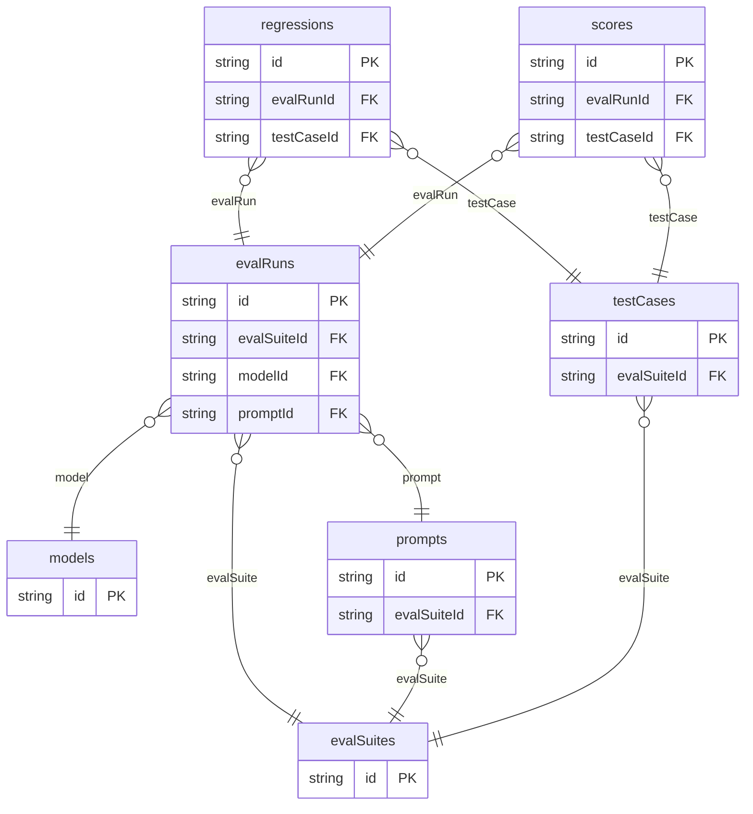

# Agent Evaluation Lab Example

## What This Teaches

Use this when an agentic app needs to compare prompts or models over fixture cases, record scored outcomes, and track regressions. The example is data-only: no model providers, graders, background jobs, or benchmark runners.

## Why This Shape?

- `evalSuites` group test cases, prompts, and runs around one evaluation goal.
- `testCases`, `models`, and `prompts` are separate inputs because each can be reused across runs.
- `evalRuns` represent one prompt/model attempt against a suite.
- `scores` are per-test-case results so aggregate pass rates do not hide individual failures.
- `regressions` are separate because failures need tracking after the run completes.

## Data Model Diagram



## Relations To Notice

- `evalRuns.evalSuiteId` relates to `evalSuites.id`, so REST can expand `evalSuite`.
- `evalRuns.modelId` relates to `models.id`, so REST can expand `model`.
- `evalRuns.promptId` relates to `prompts.id`, so REST can expand `prompt`.
- `prompts.evalSuiteId` relates to `evalSuites.id`, so REST can expand `evalSuite`.
- `regressions.evalRunId` relates to `evalRuns.id`, so REST can expand `evalRun`.
- `regressions.testCaseId` relates to `testCases.id`, so REST can expand `testCase`.
- `scores.evalRunId` relates to `evalRuns.id`, so REST can expand `evalRun`.
- `scores.testCaseId` relates to `testCases.id`, so REST can expand `testCase`.
- `testCases.evalSuiteId` relates to `evalSuites.id`, so REST can expand `evalSuite`.

## Files To Inspect

- [db/evalRuns.schema.jsonc](./db/evalRuns.schema.jsonc): source data or schema for this example.
- [db/evalSuites.schema.jsonc](./db/evalSuites.schema.jsonc): source data or schema for this example.
- [db/models.schema.jsonc](./db/models.schema.jsonc): source data or schema for this example.
- [db/prompts.schema.jsonc](./db/prompts.schema.jsonc): source data or schema for this example.
- [db/regressions.schema.jsonc](./db/regressions.schema.jsonc): source data or schema for this example.
- [db/scores.schema.jsonc](./db/scores.schema.jsonc): source data or schema for this example.
- [db/testCases.schema.jsonc](./db/testCases.schema.jsonc): source data or schema for this example.
- [src/render-html.mjs](./src/render-html.mjs): small runnable script for this example.
- [db.config.mjs](./db.config.mjs): example configuration for fixture discovery, outputs, and local runtime behavior.

## Run It

```bash
node ./src/cli.js sync --cwd ./examples/agent-evaluation-lab
node ./examples/agent-evaluation-lab/src/render-html.mjs
node ./src/cli.js serve --cwd ./examples/agent-evaluation-lab
```

## Expected Result

Sync creates `evalRuns`, `evalSuites`, `models`, `prompts`, `regressions`, `scores`, and `testCases` collections. The HTML renderer shows run summaries, pass rates, scores, and open regressions.

## Cleanup

Generated `.db/` output is ignored by git.
