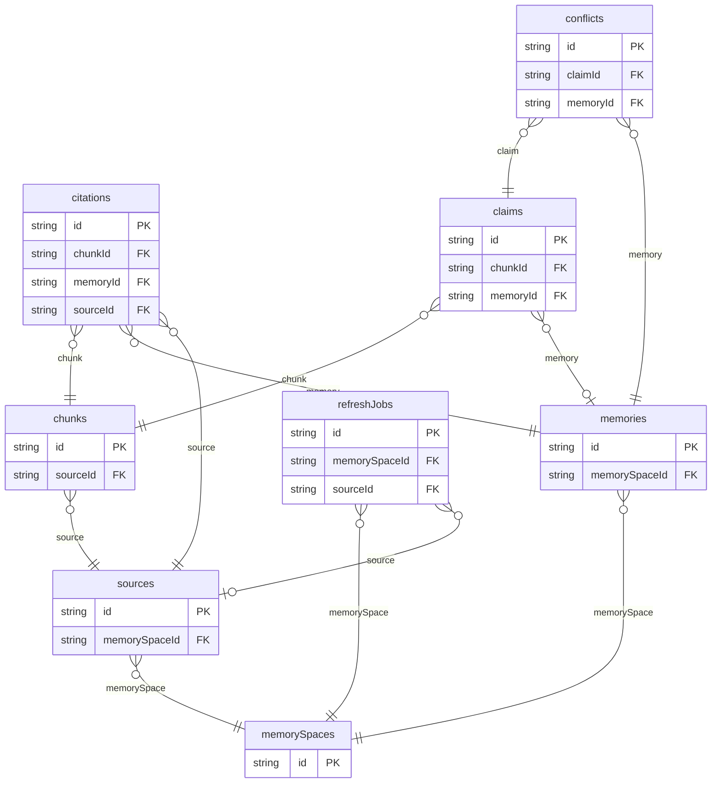

# Agent Memory Workspace Example

## What This Teaches

Use this when an agentic app needs durable memory with provenance. The example models source material, source chunks, extracted claims, accepted memories, citations, conflicts, and refresh jobs without embeddings, network fetches, or background workers.

## Why This Shape?

- `memorySpaces` group memories by product, team, or domain.
- `sources` and `chunks` preserve provenance so accepted memories can point back to evidence.
- `claims` are separate from `memories` because extracted statements may be accepted, rejected, or conflict with existing memory.
- `citations` and `conflicts` are separate review records linking durable memories back to claims and chunks.
- `refreshJobs` are separate because staleness checks have their own status and schedule.

## Data Model Diagram



## Relations To Notice

- `chunks.sourceId` relates to `sources.id`, so REST can expand `source`.
- `citations.chunkId` relates to `chunks.id`, so REST can expand `chunk`.
- `citations.memoryId` relates to `memories.id`, so REST can expand `memory`.
- `citations.sourceId` relates to `sources.id`, so REST can expand `source`.
- `claims.chunkId` relates to `chunks.id`, so REST can expand `chunk`.
- `claims.memoryId` relates to `memories.id`, so REST can expand `memory`.
- `conflicts.claimId` relates to `claims.id`, so REST can expand `claim`.
- `conflicts.memoryId` relates to `memories.id`, so REST can expand `memory`.
- `memories.memorySpaceId` relates to `memorySpaces.id`, so REST can expand `memorySpace`.
- `refreshJobs.memorySpaceId` relates to `memorySpaces.id`, so REST can expand `memorySpace`.
- `refreshJobs.sourceId` relates to `sources.id`, so REST can expand `source`.
- `sources.memorySpaceId` relates to `memorySpaces.id`, so REST can expand `memorySpace`.

## Files To Inspect

- [db/chunks.schema.jsonc](./db/chunks.schema.jsonc): source data or schema for this example.
- [db/citations.schema.jsonc](./db/citations.schema.jsonc): source data or schema for this example.
- [db/claims.schema.jsonc](./db/claims.schema.jsonc): source data or schema for this example.
- [db/conflicts.schema.jsonc](./db/conflicts.schema.jsonc): source data or schema for this example.
- [db/memories.schema.jsonc](./db/memories.schema.jsonc): source data or schema for this example.
- [db/memorySpaces.schema.jsonc](./db/memorySpaces.schema.jsonc): source data or schema for this example.
- [db/refreshJobs.schema.jsonc](./db/refreshJobs.schema.jsonc): source data or schema for this example.
- [db/sources.schema.jsonc](./db/sources.schema.jsonc): source data or schema for this example.
- [src/render-html.mjs](./src/render-html.mjs): small runnable script for this example.
- [db.config.mjs](./db.config.mjs): example configuration for fixture discovery, outputs, and local runtime behavior.

## Run It

```bash
node ./src/cli.js sync --cwd ./examples/agent-memory-workspace
node ./examples/agent-memory-workspace/src/render-html.mjs
node ./src/cli.js serve --cwd ./examples/agent-memory-workspace
```

## Expected Result

Sync creates `chunks`, `citations`, `claims`, `conflicts`, `memories`, `memorySpaces`, `refreshJobs`, and `sources` collections. The HTML renderer shows reusable memories beside their evidence, open conflicts, and refresh state.

## Cleanup

Generated `.db/` output is ignored by git.
