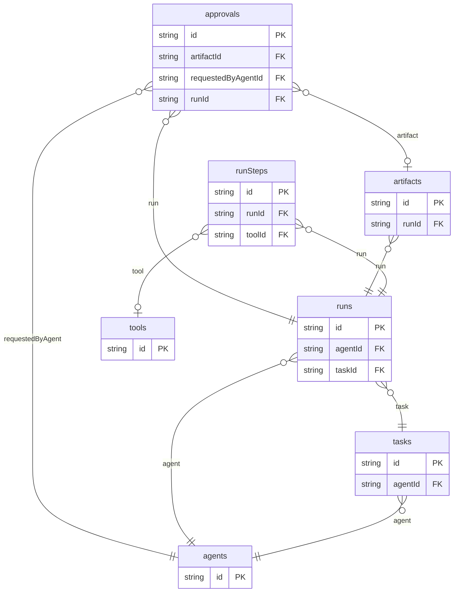

# Agent Task Board Example

## What This Teaches

Use this when an app needs to show planned agent work, run state, step-by-step progress, tool use, generated artifacts, and human approval checkpoints. The example is local fixture data only: no model calls, workers, notifications, or real tool execution.

## Why This Shape?

- `tasks` are requested work items, while `runs` are attempts to complete those tasks.
- `runSteps` are separate because each run needs ordered progress and tool references.
- `artifacts` are separate because generated outputs can be reviewed or approved after a run.
- `approvals` are separate because human checkpoints have their own requester, target artifact, and decision state.
- `agents` and `tools` are reusable catalog records used across tasks, runs, steps, and approvals.

## Data Model Diagram



## Relations To Notice

- `approvals.artifactId` relates to `artifacts.id`, so REST can expand `artifact`.
- `approvals.requestedByAgentId` relates to `agents.id`, so REST can expand `requestedByAgent`.
- `approvals.runId` relates to `runs.id`, so REST can expand `run`.
- `artifacts.runId` relates to `runs.id`, so REST can expand `run`.
- `runs.agentId` relates to `agents.id`, so REST can expand `agent`.
- `runs.taskId` relates to `tasks.id`, so REST can expand `task`.
- `runSteps.runId` relates to `runs.id`, so REST can expand `run`.
- `runSteps.toolId` relates to `tools.id`, so REST can expand `tool`.
- `tasks.agentId` relates to `agents.id`, so REST can expand `agent`.

## Files To Inspect

- [db/agents.schema.jsonc](./db/agents.schema.jsonc): source data or schema for this example.
- [db/approvals.schema.jsonc](./db/approvals.schema.jsonc): source data or schema for this example.
- [db/artifacts.schema.jsonc](./db/artifacts.schema.jsonc): source data or schema for this example.
- [db/runSteps.schema.jsonc](./db/runSteps.schema.jsonc): source data or schema for this example.
- [db/runs.schema.jsonc](./db/runs.schema.jsonc): source data or schema for this example.
- [db/tasks.schema.jsonc](./db/tasks.schema.jsonc): source data or schema for this example.
- [db/tools.schema.jsonc](./db/tools.schema.jsonc): source data or schema for this example.
- [src/render-html.mjs](./src/render-html.mjs): small runnable script for this example.
- [db.config.mjs](./db.config.mjs): example configuration for fixture discovery, outputs, and local runtime behavior.

## Run It

```bash
node ./src/cli.js sync --cwd ./examples/agent-task-board
node ./examples/agent-task-board/src/render-html.mjs
node ./src/cli.js serve --cwd ./examples/agent-task-board
```

## Expected Result

Sync creates `agents`, `approvals`, `artifacts`, `runs`, `runSteps`, `tasks`, and `tools` collections. The HTML renderer shows runs, step progress, tool usage, artifacts, and approval state.

## Cleanup

Generated `.db/` output is ignored by git.
