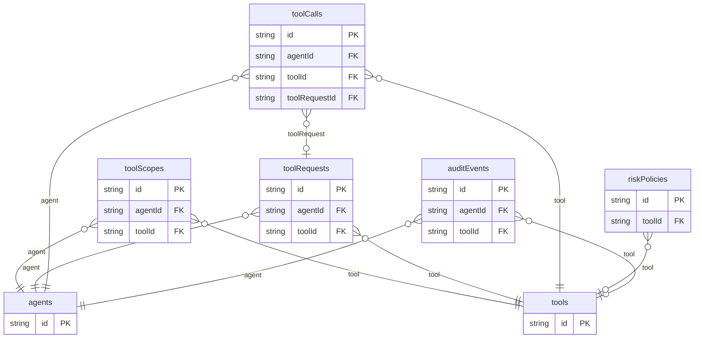

# Agent Tool Registry Example

## What This Teaches

Use this when an agentic app needs to model which agents can use which tools, when approval is required, what calls were requested, and how tool activity is audited. It is a local data model only: no real commands, network calls, credentials, or policy engine.

## Why This Shape?

- `agents` and `tools` are reusable catalogs for who can act and what can be called.
- `toolScopes` are separate grants so access can be reviewed without rewriting agent or tool records.
- `riskPolicies` are separate because approval requirements can change independently from tools.
- `toolRequests`, `toolCalls`, and `auditEvents` are separate lifecycle records for approval, execution, and review history.

## Data Model Diagram



## Relations To Notice

- `auditEvents.agentId` relates to `agents.id`, so REST can expand `agent`.
- `auditEvents.toolId` relates to `tools.id`, so REST can expand `tool`.
- `riskPolicies.toolId` relates to `tools.id`, so REST can expand `tool`.
- `toolCalls.agentId` relates to `agents.id`, so REST can expand `agent`.
- `toolCalls.toolId` relates to `tools.id`, so REST can expand `tool`.
- `toolCalls.toolRequestId` relates to `toolRequests.id`, so REST can expand `toolRequest`.
- `toolRequests.agentId` relates to `agents.id`, so REST can expand `agent`.
- `toolRequests.toolId` relates to `tools.id`, so REST can expand `tool`.
- `toolScopes.agentId` relates to `agents.id`, so REST can expand `agent`.
- `toolScopes.toolId` relates to `tools.id`, so REST can expand `tool`.

## Files To Inspect

- [db/agents.schema.jsonc](./db/agents.schema.jsonc): source data or schema for this example.
- [db/auditEvents.schema.jsonc](./db/auditEvents.schema.jsonc): source data or schema for this example.
- [db/riskPolicies.schema.jsonc](./db/riskPolicies.schema.jsonc): source data or schema for this example.
- [db/toolCalls.schema.jsonc](./db/toolCalls.schema.jsonc): source data or schema for this example.
- [db/toolRequests.schema.jsonc](./db/toolRequests.schema.jsonc): source data or schema for this example.
- [db/toolScopes.schema.jsonc](./db/toolScopes.schema.jsonc): source data or schema for this example.
- [db/tools.schema.jsonc](./db/tools.schema.jsonc): source data or schema for this example.
- [src/render-html.mjs](./src/render-html.mjs): small runnable script for this example.
- [db.config.mjs](./db.config.mjs): example configuration for fixture discovery, outputs, and local runtime behavior.

## Run It

```bash
node ./src/cli.js sync --cwd ./examples/agent-tool-registry
node ./examples/agent-tool-registry/src/render-html.mjs
node ./src/cli.js serve --cwd ./examples/agent-tool-registry
```

## Expected Result

Sync creates `agents`, `auditEvents`, `riskPolicies`, `toolCalls`, `toolRequests`, `toolScopes`, and `tools` collections. The HTML renderer shows scoped tools, pending approvals, recent calls, and audit events.

## Cleanup

Generated `.db/` output is ignored by git.
