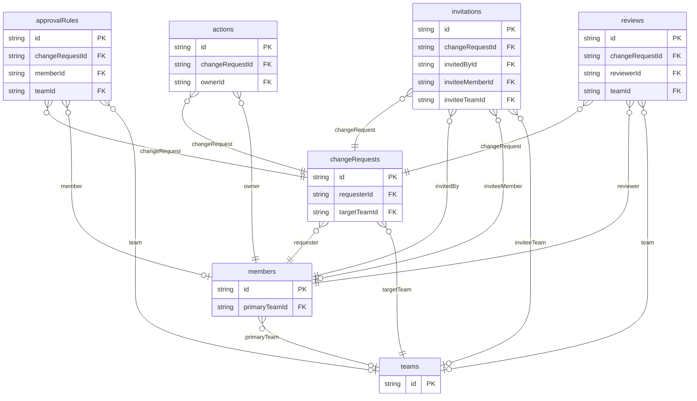

# Approval Workflow Example

## What This Teaches

Use this when people propose a change, invite reviewers or teams, collect approvals, and make a follow-up action ready. It is PR-flavored, but it avoids branch, commit, check, GitHub API, notification, worker, auth, and side-effect concepts so the data model stays focused.

## Why This Shape?

- `changeRequests` are the review subjects and own requester, target team, status, and action intent.
- `invitations`, `reviews`, and `approvalRules` are separate because invites, decisions, and requirements each have their own lifecycle.
- `actions` are separate from requests because post-approval work can be blocked, ready, or completed independently.
- `members` and `teams` are reusable across requests, reviews, approvals, and action ownership.

## Data Model Diagram



## Relations To Notice

- `actions.changeRequestId` relates to `changeRequests.id`, so REST can expand `changeRequest`.
- `actions.ownerId` relates to `members.id`, so REST can expand `owner`.
- `approvalRules.changeRequestId` relates to `changeRequests.id`, so REST can expand `changeRequest`.
- `approvalRules.memberId` relates to `members.id`, so REST can expand `member`.
- `approvalRules.teamId` relates to `teams.id`, so REST can expand `team`.
- `changeRequests.requesterId` relates to `members.id`, so REST can expand `requester`.
- `changeRequests.targetTeamId` relates to `teams.id`, so REST can expand `targetTeam`.
- `invitations.changeRequestId` relates to `changeRequests.id`, so REST can expand `changeRequest`.
- `invitations.invitedById` relates to `members.id`, so REST can expand `invitedBy`.
- `invitations.inviteeMemberId` relates to `members.id`, so REST can expand `inviteeMember`.
- `invitations.inviteeTeamId` relates to `teams.id`, so REST can expand `inviteeTeam`.
- `members.primaryTeamId` relates to `teams.id`, so REST can expand `primaryTeam`.
- `reviews.changeRequestId` relates to `changeRequests.id`, so REST can expand `changeRequest`.
- `reviews.reviewerId` relates to `members.id`, so REST can expand `reviewer`.
- `reviews.teamId` relates to `teams.id`, so REST can expand `team`.

## Files To Inspect

- [db/actions.schema.jsonc](./db/actions.schema.jsonc): source data or schema for this example.
- [db/approvalRules.schema.jsonc](./db/approvalRules.schema.jsonc): source data or schema for this example.
- [db/changeRequests.schema.jsonc](./db/changeRequests.schema.jsonc): source data or schema for this example.
- [db/invitations.schema.jsonc](./db/invitations.schema.jsonc): source data or schema for this example.
- [db/members.schema.jsonc](./db/members.schema.jsonc): source data or schema for this example.
- [db/reviews.schema.jsonc](./db/reviews.schema.jsonc): source data or schema for this example.
- [db/teams.schema.jsonc](./db/teams.schema.jsonc): source data or schema for this example.
- [src/render-html.mjs](./src/render-html.mjs): small runnable script for this example.
- [db.config.mjs](./db.config.mjs): example configuration for fixture discovery, outputs, and local runtime behavior.

## Run It

```bash
node ./src/cli.js sync --cwd ./examples/approval-workflow
node ./examples/approval-workflow/src/render-html.mjs
node ./src/cli.js serve --cwd ./examples/approval-workflow
```

## Expected Result

Sync creates `actions`, `approvalRules`, `changeRequests`, `invitations`, `members`, `reviews`, and `teams` collections. The HTML renderer shows each request, reviewer state, approval progress, invitations, and whether the related action is blocked, ready, or completed.

## Cleanup

Generated `.db/` output is ignored by git.
