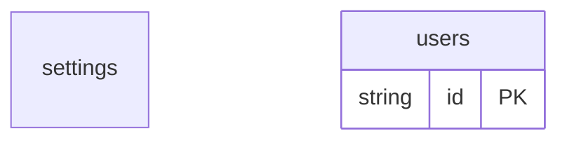

# Basic Example

## What This Teaches

Start here when you want the smallest schema-backed db workflow. It demonstrates sync, committed generated types, the viewer, fixture-like `.json` REST reads, and creating a record.

## Why This Shape?

- `users` is a schema-backed collection because it demonstrates a normal editable table with seed records, defaults, and write validation.
- `settings` is a singleton document because the app has one settings object, not many settings rows.
- `operations/get-user.jsonc` is separate from fixtures because registered operations describe approved request templates, not stored data.
- There are no cross-resource relations in this example; it keeps the first workflow focused on one collection, one document, and one write path.

## Data Model Diagram



## Relations To Notice

There are no schema-declared relations in this example; each resource can be inspected independently.

## Files To Inspect

- [db/settings.json](./db/settings.json): source data or schema for this example.
- [db/users.schema.jsonc](./db/users.schema.jsonc): source data or schema for this example.
- [db.config.mjs](./db.config.mjs): example configuration for fixture discovery, outputs, and local runtime behavior.

## Run It

```bash
node ./src/cli.js sync --cwd ./examples/basic
node ./src/cli.js serve --cwd ./examples/basic
```

## Expected Result

`sync` writes generated schema, types, and runtime state under `examples/basic/.db/`, plus the committed type copy in `src/generated/`.

`operations build` writes a full server registry and client-safe refs under
`examples/basic/src/generated/`.

To review the browser-facing operation contract without volatile timestamps:

```bash
node ./src/cli.js operations contract --cwd ./examples/basic
node ./src/cli.js operations contract --cwd ./examples/basic --check
```

## REST Request To Try

Leave `serve` running and run this from another terminal:

```bash
curl http://127.0.0.1:7331/db/users.json
```

The `.json` route is intentional: a source fixture such as `db/users.json`
maps naturally to `GET /db/users.json`, while the server still reads from the
synced runtime resource under `.db/state`.

Create a local runtime record:

```bash
curl -X POST http://127.0.0.1:7331/db/users \
  -H 'content-type: application/json' \
  -d '{"id":"u_2","name":"Grace Hopper","email":"grace@example.com"}'
```

The equivalent CLI smoke command is:

```bash
node ./src/cli.js create users '{"id":"u_2","name":"Grace Hopper","email":"grace@example.com"}' --cwd ./examples/basic
```

## Registered Operation To Try

Build operations, then use the generated ref from
`examples/basic/src/generated/db.operation-refs.json`:

```bash
curl -X POST http://127.0.0.1:7331/__db/operations/REF \
  -H 'content-type: application/json' \
  -d '{"variables":{"id":"u_1"}}'
```

## Features To Notice

- [Fixture-like `.json` REST routes](../../docs/server-and-viewer.md#fixture-like-json-routes)
- [Schema-backed fixtures](../../docs/fixtures-and-schemas.md#schema-files)
- [Generated types](../../docs/generated-files.md#generated-types)
- [Registered REST operations](../../docs/server-and-viewer.md#registered-rest-operations)

## Cleanup

Generated `.db/` output is ignored by git and can be removed whenever you want a fresh mirror.

## More Docs

- [Getting Started](../../docs/getting-started.md)
- [Generated Files](../../docs/generated-files.md)
