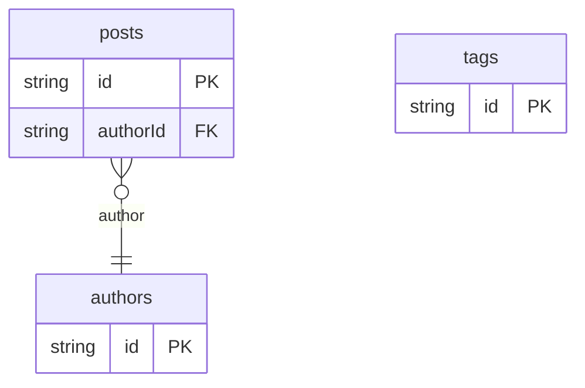

# Blog Example

## What This Teaches

Use this when you want a familiar content model that is richer than a flat posts table. The example models authors and tags as schema-backed collections, then reads post Markdown from a date-based folder tree such as `db/posts/2026/05/01/local-fixtures-first.md`.

## Why This Shape?

This example mixes folder-backed and file-backed resources:

```txt
db/
  posts/                                  # folder is the posts collection
    2026/05/01/local-fixtures-first.md    # one posts record
    2026/05/15/release-notes-as-data.md   # one posts record

  authors.schema.jsonc                    # file is the authors collection
  tags.schema.jsonc                       # file is the tags collection
```

The `posts` folder mirrors how blogs are usually stored on disk, while authors
and tags stay as compact schema-backed collections.

Markdown stays in date-based source files because authors usually want stable
paths and git-friendly diffs. Authors and tags are separate collections because
many posts can reuse the same profile or label.

## Data Model Diagram



## Relations To Notice

- `posts.authorId` relates to `authors.id`, so REST can expand `author`.
- `posts.tagIds` are plain ids that app code can map to `tags`.
- `posts.relatedPostIds` are plain ids for lightweight related-content links.
- Try `expand=author` when you want REST to include the author profile with each post.

## Files To Inspect

- [db/authors.schema.jsonc](./db/authors.schema.jsonc): source data or schema for this example.
- [db/posts.schema.jsonc](./db/posts.schema.jsonc): source data or schema for this example.
- [db/posts/2026/05/01/local-fixtures-first.md](./db/posts/2026/05/01/local-fixtures-first.md): source data or schema for this example.
- [db/posts/2026/05/15/release-notes-as-data.md](./db/posts/2026/05/15/release-notes-as-data.md): source data or schema for this example.
- [db/tags.schema.jsonc](./db/tags.schema.jsonc): source data or schema for this example.
- [db.config.mjs](./db.config.mjs): example configuration for fixture discovery, outputs, and local runtime behavior.

## Run It

```bash
node ./src/cli.js sync --cwd ./examples/blog
node ./src/cli.js serve --cwd ./examples/blog
```

## Expected Result

Sync creates `authors`, `posts`, and `tags` collections. The post records include image metadata, Markdown body text, nullable publish dates, and source paths derived from the folder structure.

## Cleanup

Generated `.db/` output is ignored by git.
