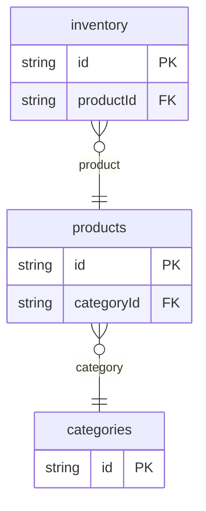

# Catalog Example

## What This Teaches

Use this when you want a familiar product catalog model. The example keeps products, categories, product images, prices, and inventory as small fixture-backed collections.

This is intentionally simpler than [Ecommerce](../ecommerce/README.md). Start here for browseable product data, then use ecommerce when you need checkout, orders, payments, and shipments.

## Why This Shape?

- `products` are the records a shopper browses, so they hold names, descriptions, prices, tags, and nested image arrays.
- `categories` are separate because many products can share one navigation category.
- `inventory` is separate because stock has its own quantity and location lifecycle.
- Product images stay nested because this small catalog edits them with the parent product.

## Data Model Diagram



## Relations To Notice

- `inventory.productId` relates to `products.id`, so REST can expand `product`.
- `products.categoryId` relates to `categories.id`, so REST can expand `category`.

## Files To Inspect

- [db/categories.schema.jsonc](./db/categories.schema.jsonc): source data or schema for this example.
- [db/inventory.schema.jsonc](./db/inventory.schema.jsonc): source data or schema for this example.
- [db/products.schema.jsonc](./db/products.schema.jsonc): source data or schema for this example.
- [src/render-html.mjs](./src/render-html.mjs): small runnable script for this example.
- [db.config.mjs](./db.config.mjs): example configuration for fixture discovery, outputs, and local runtime behavior.

## Run It

```bash
node ./src/cli.js sync --cwd ./examples/catalog
node ./examples/catalog/src/render-html.mjs
node ./src/cli.js serve --cwd ./examples/catalog
```

## Expected Result

Sync creates `categories`, `inventory`, and `products` collections. The HTML renderer shows products joined to categories and inventory without adding app framework code. REST expansion can resolve each product category and each inventory row's product.

## Cleanup

Generated `.db/` output is ignored by git.
