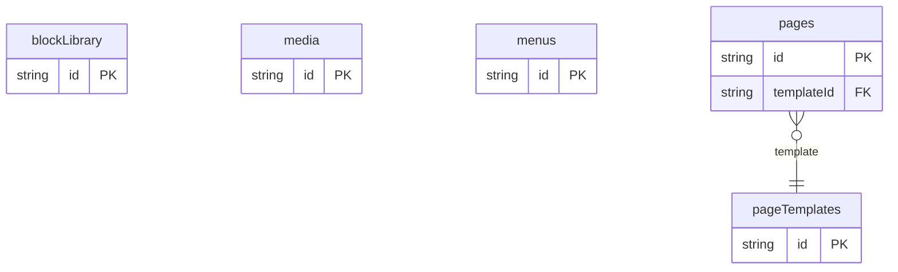

# CMS With Page Builder Example

## What This Teaches

Use this when a marketing site needs a small CMS that manages pages and reusable page-builder blocks. The example keeps the records plain: templates describe allowed block kinds, the block library describes reusable block shapes, pages store ordered block instances and published/unpublished state, and media plus menus sit beside them.

## Files To Inspect

- [db/pages.schema.jsonc](./db/pages.schema.jsonc): page records with published/unpublished status, template relation, SEO fields, and ordered block instances.
- [db/pageTemplates.schema.jsonc](./db/pageTemplates.schema.jsonc): reusable templates that constrain page-builder block choices.
- [db/blockLibrary.schema.jsonc](./db/blockLibrary.schema.jsonc): reusable block definitions an editor can pick from.
- [db/media.schema.jsonc](./db/media.schema.jsonc): media metadata referenced by page blocks.
- [db/menus.schema.jsonc](./db/menus.schema.jsonc): header and footer navigation.
- [src/render-html.mjs](./src/render-html.mjs): very small Tailwind CDN HTML renderer using the package API.

## Run It

```bash
node ./src/cli.js sync --cwd ./examples/cms-with-page-builder
node ./examples/cms-with-page-builder/src/render-html.mjs > /tmp/db-cms-with-page-builder.html
node ./src/cli.js serve --cwd ./examples/cms-with-page-builder
```

Open `http://127.0.0.1:7331/__db` or fetch page data:

```bash
curl 'http://127.0.0.1:7331/db/pages.json?select=id,title,status,slug,template,blocks&expand=template'
```

## Why This Shape?

Marketing CMS projects usually need a page builder before they need a full production CMS. This model keeps those concerns separate:

- `pages` are the actual editable pages and published/unpublished states.
- `pageTemplates` describe the page types editors can choose.
- `blockLibrary` describes reusable block kinds without hiding the page's own block content.
- `media` and `menus` stay normal records so a custom app UI can manage them through the same API.

## Data Model Diagram



## Relations To Notice

- `pages.templateId` is a relation to `pageTemplates.id`, so REST can use `expand=template`.
- Block `libraryBlockId` and `mediaId` values are plain ids inside nested block records. The example keeps block instances nested because page-builder UIs usually edit them as part of the page.
- Menu item `pageId` values are plain ids in this example, so navigation can stay lightweight and app-owned.

The demo does not execute publishing, run previews, or integrate with a third-party CMS. It only shows the local data shape and how an app can read it.

## Cleanup

Generated `.db/` output is ignored by git.
