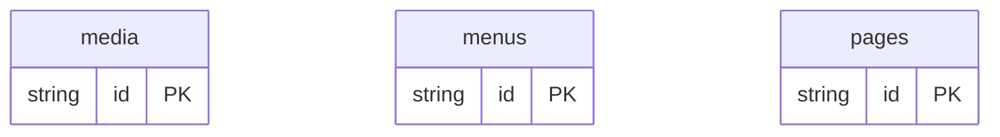

# CMS Example

## What This Teaches

Use this when you want a simple CMS content model without adding CMS runtime code. The example keeps pages, published/unpublished state, simple nested blocks, media assets, and navigation in fixture-backed collections, then renders a tiny static HTML preview from those records.

## Why This Shape?

- `pages` are the editable content records and own publish state, SEO fields, and ordered content blocks.
- `media` is separate because many pages or blocks can reuse the same asset metadata.
- `menus` are separate because navigation has its own location and item order.
- Blocks stay nested inside pages because this simple CMS edits block content as part of the page.

## Data Model Diagram



## Relations To Notice

There are no schema-declared relations in this example; each resource can be inspected independently.

## Files To Inspect

- [db/media.schema.jsonc](./db/media.schema.jsonc): source data or schema for this example.
- [db/menus.schema.jsonc](./db/menus.schema.jsonc): source data or schema for this example.
- [db/pages.schema.jsonc](./db/pages.schema.jsonc): source data or schema for this example.
- [src/render-html.mjs](./src/render-html.mjs): small runnable script for this example.
- [db.config.mjs](./db.config.mjs): example configuration for fixture discovery, outputs, and local runtime behavior.

## Run It

```bash
node ./src/cli.js sync --cwd ./examples/cms
node ./examples/cms/src/render-html.mjs
node ./src/cli.js serve --cwd ./examples/cms
```

## Expected Result

Sync creates `media`, `menus`, and `pages` collections. The HTML renderer shows page records, published/unpublished counts, menu items, and nested blocks without becoming a real CMS. The page schema demonstrates a lightweight CMS content shape: publish state, nested block arrays, image references, SEO fields, and app-owned layout settings.

## Cleanup

Generated `.db/` output is ignored by git.
