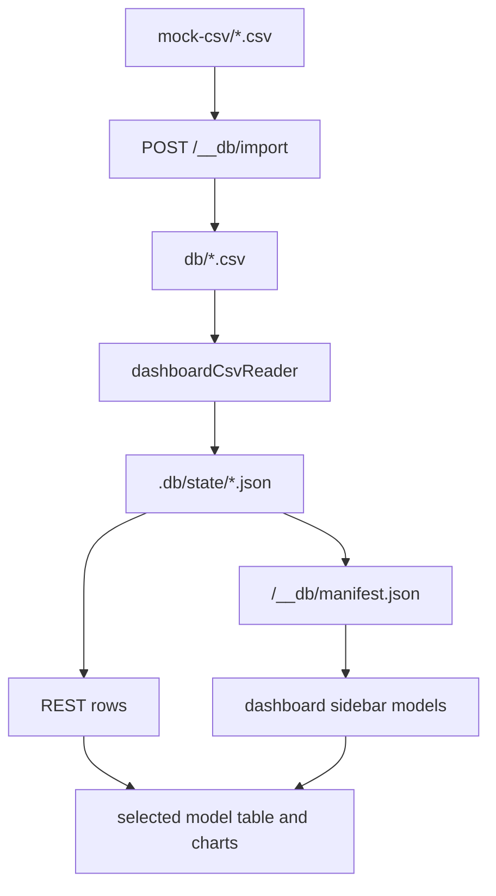

# CSV Dashboard Example

## What This Teaches

Use this when a user has a spreadsheet export and wants a local dashboard before any schema or saved chart contract exists. The example starts with an empty `db/` folder, imports CSV files through the existing viewer import endpoint, then builds charts and tables from the live runtime manifest plus REST records.

## Why This Shape?

- The empty `db/` folder is intentional because uploaded CSV files become the source fixtures.
- Runtime discovery is the contract for this first slice: each imported CSV becomes a model in `/__db/manifest.json` and appears in the dashboard sidebar.
- The dashboard reads JSON runtime rows mirrored into `.db/state/*.json` through REST routes, then uses inferred row values for numeric summaries, category bars, boolean splits, and table previews.
- CSV sources stay as CSV files in `db/`; this example intentionally does not create `db/*.json` sidecars.
- There are no schema-declared relations in this example; each CSV is treated as a flat standalone collection.
- Saved or pinned dashboards are intentionally left for a later core API design after the runtime workflow is proven.

## Runtime Flow Diagram



## Files To Inspect

- [db/.gitkeep](./db/.gitkeep): keeps the otherwise empty fixture folder in git.
- [mock-csv/](./mock-csv): ten sample CSV files you can drag into the dashboard.
- [db.config.mjs](./db.config.mjs): runtime mirror setup and example-owned CSV source reader registration.
- [src/dashboard-csv-reader.mjs](./src/dashboard-csv-reader.mjs): reader API example that parses CSV source fixtures into JSON-like records for the runtime mirror.
- [src/dashboard.js](./src/dashboard.js): browser app plus pure dashboard inference/render helpers.
- [src/dashboard-html.mjs](./src/dashboard-html.mjs): dependency-free HTML shell.
- [src/start-csv-dashboard-server.mjs](./src/start-csv-dashboard-server.mjs): custom server that mounts the dashboard before the stock db routes.
- [serve.mjs](./serve.mjs): local entry point for this example.
- [serve-example.mjs](./serve-example.mjs): `npm run examples` hook.

## Run It

From the repository root:

```bash
node ./examples/csv-dashboard/serve.mjs
```

Open:

```txt
http://127.0.0.1:7343/
```

The built-in viewer is still available:

```txt
http://127.0.0.1:7343/__db
```

Options:

```bash
node ./examples/csv-dashboard/serve.mjs --port 8080 --host 127.0.0.1
node ./examples/csv-dashboard/serve.mjs --no-sync
```

`--no-sync` skips fixture sync on startup. Use it only after `.db/state` already exists.

## Sample CSVs

Use the files in [mock-csv/](./mock-csv) when you want quick drag-and-drop data:

- `customers.csv`
- `orders.csv`
- `support-tickets.csv`
- `product-inventory.csv`
- `marketing-campaigns.csv`
- `app-events.csv`
- `team-capacity.csv`
- `revenue-by-region.csv`
- `content-calendar.csv`
- `device-fleet.csv`

## Expected Result

The first screen has no model cards. Drop a `.csv` file into the upload zone. The server copies it into `db/`, the source reader parses it, sync writes `.db/state/<model>.json`, refreshes the manifest, and adds the new CSV model to the sidebar. Selecting that model shows the data table first, followed by row count, column count, inferred field details, and generated chart cards.

## REST Request To Try

After importing a file named `Customers.csv`, try:

```bash
curl 'http://127.0.0.1:7343/db/customers.json?limit=5'
```

## Features To Notice

- [CSV fixtures](../../docs/fixtures-and-schemas.md#csv-fixtures)
- [CSV import](../../docs/server-and-viewer.md#viewer-and-custom-viewers)
- [Custom viewer manifest](../../docs/server-and-viewer.md#custom-viewer-manifest)
- [Fixture-like `.json` REST routes](../../docs/server-and-viewer.md#fixture-like-json-routes)

## Cleanup

Imported CSV files are source fixtures in `db/`. Generated `.db/` output is ignored by git and can be removed whenever you want fresh runtime state.
