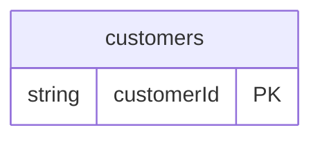

# CSV Example

## What This Teaches

Use this when product, customer, or spreadsheet-like data starts as CSV. db scans the header row, infers field shapes, generates types, and mirrors the rows into JSON runtime state.

## Why This Shape?

- `customers.csv` is a single source table because CSV works best for flat, spreadsheet-like rows.
- The runtime mirror becomes JSON so the same REST and viewer workflow works after sync.
- There are no cross-resource relations in this example; it keeps the focus on CSV inference and source refresh behavior.

## Data Model Diagram



## Relations To Notice

There are no schema-declared relations in this example; each resource can be inspected independently.

## Files To Inspect

- [db/customers.csv](./db/customers.csv): source data or schema for this example.
- [db.config.mjs](./db.config.mjs): example configuration for fixture discovery, outputs, and local runtime behavior.

## Run It

```bash
node ./src/cli.js sync --cwd ./examples/csv
node ./src/cli.js serve --cwd ./examples/csv
```

## Expected Result

`sync` writes `.db/state/customers.json`. When `db/customers.csv` changes, the source hash changes and the JSON store refreshes from CSV.

## REST Request To Try

Leave `serve` running and run this from another terminal:

```bash
curl 'http://127.0.0.1:7331/db/customers.json?select=id,name,email'
```

## Features To Notice

- [CSV fixtures](../../docs/fixtures-and-schemas.md#csv-fixtures)
- [Runtime state refreshes](../../docs/generated-files.md#runtime-state)
- [Fixture-like `.json` REST routes](../../docs/server-and-viewer.md#fixture-like-json-routes)

## Cleanup

Generated `.db/` output is ignored by git and can be removed whenever you want fresh runtime state.

## More Docs

- [Fixtures And Schemas](../../docs/fixtures-and-schemas.md)
- [Generated Files](../../docs/generated-files.md)
