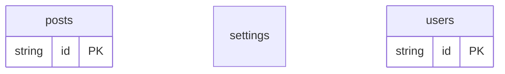

# Data-First Example

## What This Teaches

Use this when you have fixture data before you have a contract. db infers collections, singleton documents, REST routes, GraphQL fields, and TypeScript types from plain JSON.

## Why This Shape?

- `users.json` and `posts.json` are arrays, so async/db infers them as collections.
- `settings.json` is an object, so async/db infers it as a singleton document.
- The example intentionally avoids schema files so the inferred model is easy to inspect before adding stricter contracts.
- There are no schema-declared relations yet; any ids in plain data stay normal fields until a schema adds relation metadata.

## Data Model Diagram



## Relations To Notice

There are no schema-declared relations in this example; each resource can be inspected independently.

## Files To Inspect

- [db/posts.json](./db/posts.json): source data or schema for this example.
- [db/settings.json](./db/settings.json): source data or schema for this example.
- [db/users.json](./db/users.json): source data or schema for this example.
- [db.config.mjs](./db.config.mjs): example configuration for fixture discovery, outputs, and local runtime behavior.

## Run It

```bash
node ./src/cli.js sync --cwd ./examples/data-first
node ./src/cli.js serve --cwd ./examples/data-first
```

## Expected Result

`sync` infers schema and writes generated runtime state under `examples/data-first/.db/`.

## REST Request To Try

Leave `serve` running and run this from another terminal:

```bash
curl 'http://127.0.0.1:7331/db/users.json?select=id,name,email'
```

## Features To Notice

- [Data-first JSON fixtures](../../docs/fixtures-and-schemas.md#data-first-json-or-jsonc)
- [Fixture-like `.json` REST routes](../../docs/server-and-viewer.md#fixture-like-json-routes)
- [REST query parameters](../../docs/server-and-viewer.md#rest-routes)
- [Runtime state](../../docs/generated-files.md#runtime-state)

## Cleanup

Generated `.db/` output is ignored by git and can be removed whenever you want a fresh mirror.

## More Docs

- [Concepts](../../docs/concepts.md)
- [Fixtures And Schemas](../../docs/fixtures-and-schemas.md)
