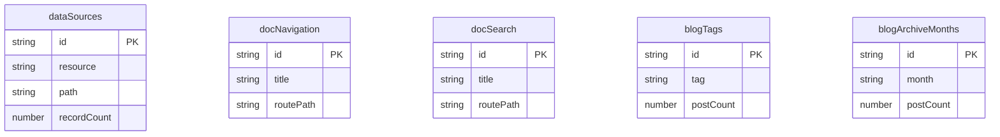

# Derived Sources Example

## What This Teaches

Use this when Async DB resources should be computed from fixture files without committing generated fixtures. This example has several mini-cases in one project:

- `dataSources` indexes plain JSON fixtures under [db/data](./db/data).
- `docNavigation` and `docSearch` are derived from docs Markdown under [db/content/docs](./db/content/docs).
- `blogTags` and `blogArchiveMonths` are derived from blog Markdown under [db/content/blog](./db/content/blog).

Derived source functions are trusted local project code. async/db provides the `sources.derived` hook, dependency file context, composite source hashes, and the normal schema/type/runtime pipeline.

## Why This Shape?

This example shows several virtual collections derived from source files:

```txt
db/
  data/
    projects.json  # normal dependency fixture
    users.json     # normal dependency fixture
  content/
    docs/
      index.md
      guides/publishing.md
      reference/derived-sources.md
    blog/
      2026/05/static-content.md
      2026/05/local-indexes.md
      2026/06/preview-workflows.md
```

The derived resources do not have physical JSON fixture files. They are rebuilt whenever `sync` or `serve` loads the project, and their JSON runtime mirrors refresh when one dependency hash changes.

Each mini-case demonstrates a different static-data use:

- A fixture catalog from sibling JSON files.
- Docs navigation and search records from Markdown frontmatter/body text.
- Blog tag pages and archive months from Markdown post metadata.

The source data stays inspectable in git because the underlying JSON and Markdown files remain the only committed inputs.

## Data Model Diagram



## Relations To Notice

There are no schema-declared relations in this example. The derived resources are app-facing indexes built from local fixture files.

## Files To Inspect

- [db/data/projects.json](./db/data/projects.json): dependency fixture indexed by the derived source.
- [db/data/users.json](./db/data/users.json): dependency fixture indexed by the derived source.
- [db/content/docs/index.md](./db/content/docs/index.md): Markdown docs source used for navigation and search records.
- [db/content/blog/2026/05/static-content.md](./db/content/blog/2026/05/static-content.md): Markdown blog source used for tag and archive records.
- [db.config.mjs](./db.config.mjs): configures `sources.derived` and builds the virtual resource.

## Run It

```bash
node ./src/cli.js sync --cwd ./examples/derived-sources
node ./src/cli.js serve --cwd ./examples/derived-sources
```

## Expected Result

Sync creates `dataSources`, `docNavigation`, `docSearch`, `blogTags`, and `blogArchiveMonths` alongside the normal `projects` and `users` JSON resources. The generated `.db/state/.sources.json` entries record derived source hashes and dependency file hashes.

## Cleanup

Generated `.db/` output is ignored by git.
