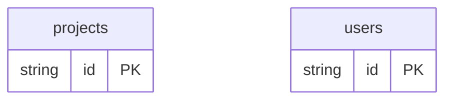

# Diagnostics Example

## What This Teaches

Use this when you want to see how db reports local fixture drift. It intentionally includes schema/data mismatches so the viewer can show source diagnostics while valid resources still work.

## Why This Shape?

- `users` has both schema and data files so the example can show mixed-mode drift when a fixture contains an unknown field.
- `projects` is schema-backed and intentionally includes a nested mismatch so diagnostics cover more than top-level fields.
- The resources are separate so one broken source can report diagnostics without making unrelated resources unusable.
- There are no cross-resource relations in this example; the focus is schema/data validation and partial recovery.

## Data Model Diagram



## Relations To Notice

There are no schema-declared relations in this example; each resource can be inspected independently.

## Files To Inspect

- [db/projects.schema.jsonc](./db/projects.schema.jsonc): source data or schema for this example.
- [db/users.json](./db/users.json): source data or schema for this example.
- [db/users.schema.jsonc](./db/users.schema.jsonc): source data or schema for this example.
- [db.config.mjs](./db.config.mjs): example configuration for fixture discovery, outputs, and local runtime behavior.

## Run It

```bash
node ./src/cli.js sync --cwd ./examples/diagnostics
node ./src/cli.js serve --cwd ./examples/diagnostics
```

## Expected Result

`sync` reports warnings. The viewer surfaces diagnostics for the broken source files instead of making unrelated resources unusable.

## REST Request To Try

Leave `serve` running and run this from another terminal:

```bash
curl http://127.0.0.1:7331/db/users.json
```

Expected diagnostics include an extra `twitterHandle` field in `users.json` and an undefined nested `metadata.priority` field in `projects.schema.jsonc`.

## Features To Notice

- [Diagnostics workflow](../../docs/concepts.md#diagnostics)
- [Schema validation](../../docs/fixtures-and-schemas.md#schema-files)
- [Fixture-like `.json` REST routes](../../docs/server-and-viewer.md#fixture-like-json-routes)

## Cleanup

Generated `.db/` output is ignored by git and can be removed whenever you want a fresh mirror.

## More Docs

- [Concepts](../../docs/concepts.md)
- [Fixtures And Schemas](../../docs/fixtures-and-schemas.md)
