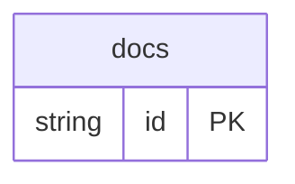

# Docs Example

## What This Teaches

Use this when a non-JSON source should stay the source of truth. The example keeps docs content in a folder tree under [db/docs](./db/docs), then `db.config.mjs` converts each Markdown file into a record for the `docs` collection.

The reader is example-owned code. async/db only provides the `sources.readers` hook and the source-reader context.

## Why This Shape?

This example shows a folder-backed collection:

```txt
db/
  docs/                       # folder is the docs collection
    index.md                  # one docs record
    guides/getting-started.md # one docs record
    reference/custom-readers.md
```

That is the same resource model as a simple `db/users.json` collection, but the
source shape matches how documentation is usually authored: many Markdown files
laid out by folder and route.

Each Markdown file becomes one `docs` record with route and source metadata.
There are no cross-resource relations in this example; docs pages are static
content records, so links between pages stay inside Markdown body text.

## Mix With JSON Collections

This example can live beside normal JSON-backed collections in a mixed resources/stores setup. Only `docs` needs explicit config because it opts into `resources.docs.store: 'static'`; omitted resources keep the default writable JSON store.

## Data Model Diagram



## Relations To Notice

There are no schema-declared relations in this example; each resource can be inspected independently.

## Files To Inspect

- [db/docs/guides/getting-started.md](./db/docs/guides/getting-started.md): source data or schema for this example.
- [db/docs/index.md](./db/docs/index.md): source data or schema for this example.
- [db/docs/reference/custom-readers.md](./db/docs/reference/custom-readers.md): source data or schema for this example.
- [db.config.mjs](./db.config.mjs): example configuration for fixture discovery, outputs, and local runtime behavior.

## Run It

```bash
node ./src/cli.js sync --cwd ./examples/docs
node ./src/cli.js serve --cwd ./examples/docs
```

## Expected Result

Sync creates a `docs` collection with `bodyMarkdown`, `tags`, `section`, `slug`, `routePath`, `sourcePath`, and `order` fields inferred from Markdown source.

The `docs` resource uses the built-in static store so Markdown remains the source of truth. App writes do not shadow docs content in `.db/state`.

## Cleanup

Generated `.db/` output is ignored by git.
