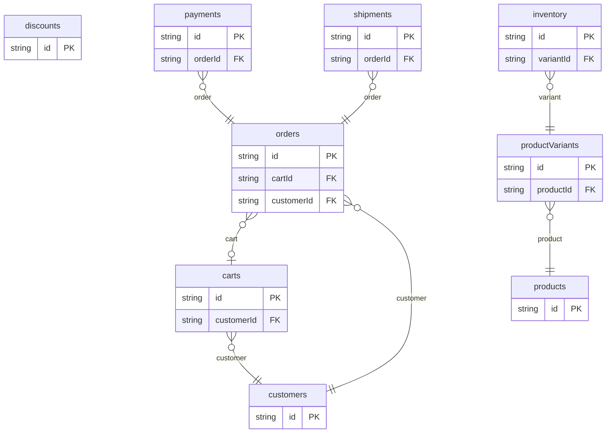

# Ecommerce Example

## What This Teaches

Use this after [Catalog](../catalog/README.md). The catalog example focuses on product browsing: products, categories, prices, images, and inventory. This ecommerce example is more advanced because it adds checkout and fulfillment data: customers, carts, discounts, orders, payments, and shipments.

It is still intentionally small. The goal is to show the data model shape for a lightweight store, not to implement payment processing, tax calculation, or warehouse logic.

## Why This Shape?

The model is split around the lifecycle of a purchase:

```txt
store setup
  products
    +-- productVariants
          +-- inventory

checkout
  customers
    +-- carts
          +-- carts.items[]         nested editable line items
          +-- discounts             referenced by discountCode

placed order
  orders
    +-- orders.items[]              snapshot of purchased line items
    +-- payments
    +-- shipments
          +-- shipments.items[]     what was fulfilled
```

The same relationships as a graph:

```txt
products -> productVariants -> inventory
customers -> carts -> orders -> payments
                         |
                         +-> shipments
discounts -> carts.discountCode
```

## Data Model Diagram



## Modeling Decisions

Product vs. variant:

`products` are what shoppers browse. `productVariants` are what carts, orders, and inventory point at because variants are the sellable SKUs.

Cart vs. order:

`carts` are editable checkout state. `orders` are the placed purchase snapshot. After checkout, the order keeps the title, unit price, quantity, totals, and shipping address that were true at purchase time, even if the product changes later.

Nested line items stay inside `carts`, `orders`, and `shipments` because small checkout and fulfillment screens usually edit them with the parent record.

## Relations To Notice

- `carts.customerId` relates to `customers.id`, so REST can expand `customer`.
- `inventory.variantId` relates to `productVariants.id`, so REST can expand `variant`.
- `orders.cartId` relates to `carts.id`, so REST can expand `cart`.
- `orders.customerId` relates to `customers.id`, so REST can expand `customer`.
- `payments.orderId` relates to `orders.id`, so REST can expand `order`.
- `productVariants.productId` relates to `products.id`, so REST can expand `product`.
- `shipments.orderId` relates to `orders.id`, so REST can expand `order`.

## Files To Inspect

- [db/carts.schema.jsonc](./db/carts.schema.jsonc): source data or schema for this example.
- [db/customers.schema.jsonc](./db/customers.schema.jsonc): source data or schema for this example.
- [db/discounts.schema.jsonc](./db/discounts.schema.jsonc): source data or schema for this example.
- [db/inventory.schema.jsonc](./db/inventory.schema.jsonc): source data or schema for this example.
- [db/orders.schema.jsonc](./db/orders.schema.jsonc): source data or schema for this example.
- [db/payments.schema.jsonc](./db/payments.schema.jsonc): source data or schema for this example.
- [db/productVariants.schema.jsonc](./db/productVariants.schema.jsonc): source data or schema for this example.
- [db/products.schema.jsonc](./db/products.schema.jsonc): source data or schema for this example.
- [db/shipments.schema.jsonc](./db/shipments.schema.jsonc): source data or schema for this example.
- [src/render-summary.mjs](./src/render-summary.mjs): small runnable script for this example.
- [db.config.mjs](./db.config.mjs): example configuration for fixture discovery, outputs, and local runtime behavior.

## Run It

```bash
node ./src/cli.js sync --cwd ./examples/ecommerce
node ./examples/ecommerce/src/render-summary.mjs
node ./src/cli.js serve --cwd ./examples/ecommerce
```

## Expected Result

Sync creates `carts`, `customers`, `discounts`, `inventory`, `orders`, `payments`, `productVariants`, `products`, and `shipments` collections. REST expansion can resolve top-level relations such as order customer, payment order, shipment order, and variant product.

Line items stay nested inside carts, orders, and shipments because most small ecommerce UIs edit them as part of the parent checkout or fulfillment record.

## Cleanup

Generated `.db/` output is ignored by git.
