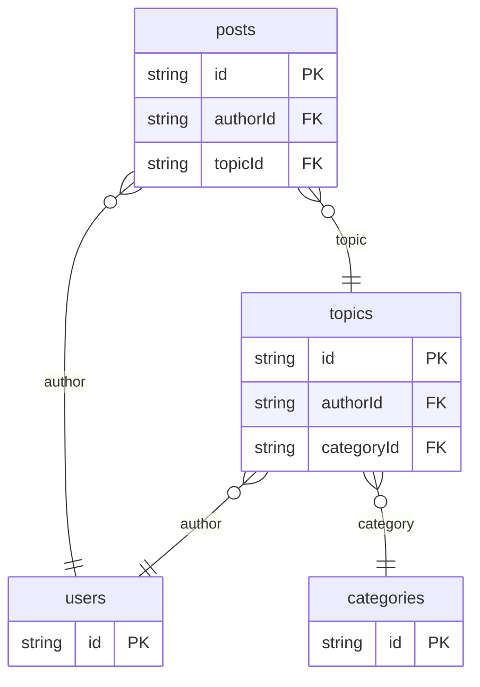

# Forums Example

## What This Teaches

Use this when you want a very small community/discussion data model. The example focuses on the first records most forum apps need: users, categories, topics, posts, status, pinned topics, and Markdown replies.

## Why This Shape?

- `categories` are top-level sections because many topics share one section.
- `topics` own workflow state such as pinned/open/locked status.
- `posts` are separate from topics because replies have their own author and timestamps.
- `users` are separate because both topics and replies need reusable member records.

## Data Model Diagram



## Relations To Notice

- `posts.authorId` relates to `users.id`, so REST can expand `author`.
- `posts.topicId` relates to `topics.id`, so REST can expand `topic`.
- `topics.authorId` relates to `users.id`, so REST can expand `author`.
- `topics.categoryId` relates to `categories.id`, so REST can expand `category`.

## Files To Inspect

- [db/categories.schema.jsonc](./db/categories.schema.jsonc): source data or schema for this example.
- [db/posts.schema.jsonc](./db/posts.schema.jsonc): source data or schema for this example.
- [db/topics.schema.jsonc](./db/topics.schema.jsonc): source data or schema for this example.
- [db/users.schema.jsonc](./db/users.schema.jsonc): source data or schema for this example.
- [src/render-html.mjs](./src/render-html.mjs): small runnable script for this example.
- [db.config.mjs](./db.config.mjs): example configuration for fixture discovery, outputs, and local runtime behavior.

## Run It

```bash
node ./src/cli.js sync --cwd ./examples/forums
node ./examples/forums/src/render-html.mjs
node ./src/cli.js serve --cwd ./examples/forums
```

## Expected Result

Sync creates `categories`, `posts`, `topics`, and `users` collections. The HTML renderer shows topics joined to categories, authors, and reply counts. REST expansion can resolve a topic's category and author, and each post can resolve its topic and author.

## Cleanup

Generated `.db/` output is ignored by git.
