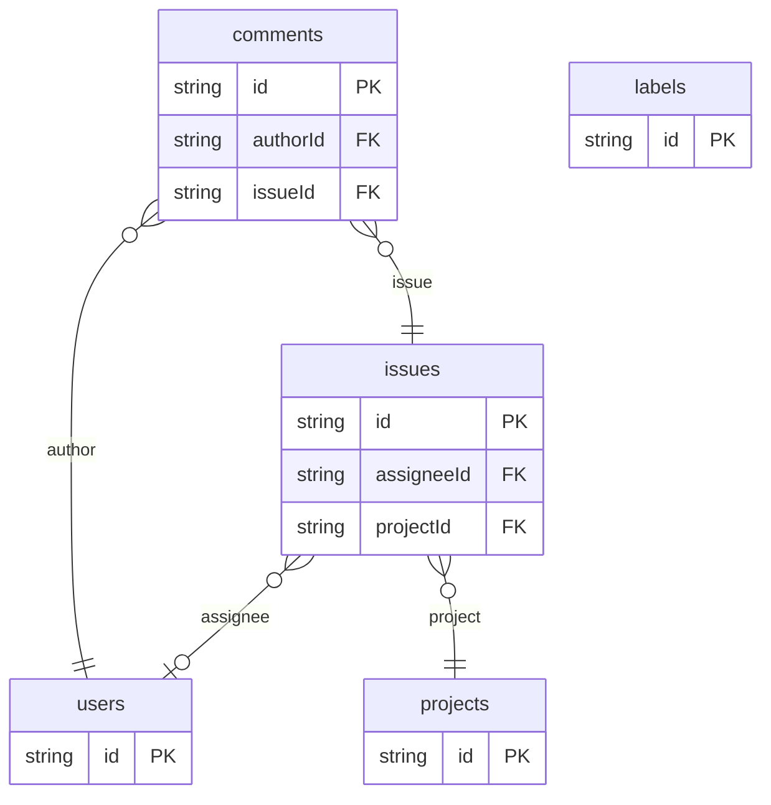

# Issue Tracker Example

## What This Teaches

Use this when you want a common workflow database shape: projects, issues, comments, users, labels, assignment, status, and priority. It stays data-model focused and includes only a tiny static HTML board to show how the records fit together.

## Why This Shape?

- `projects` group work so issue keys and summaries can be scoped.
- `issues` own workflow fields such as status, priority, assignee, and label ids.
- `comments` are separate because they have their own author and timestamp lifecycle.
- `users` are separate so assignees and commenters can be reused across issues.
- `labels` are separate app-owned records, while issue `labelIds` stay a lightweight id array.

## Data Model Diagram



## Relations To Notice

- `issues.projectId` and `issues.assigneeId` relate issues to `projects.id` and `users.id`, so REST can use `expand=project,assignee`.
- `comments.issueId` and `comments.authorId` relate comments to issues and users.
- `issues.labelIds` are plain ids, not async/db relation metadata, because this example keeps many-label display logic app-owned.

## Files To Inspect

- [db/projects.schema.jsonc](./db/projects.schema.jsonc): project records.
- [db/issues.schema.jsonc](./db/issues.schema.jsonc): issue workflow fields and relations.
- [db/comments.schema.jsonc](./db/comments.schema.jsonc): comments related to issues and users.
- [db/users.schema.jsonc](./db/users.schema.jsonc): assignees and commenters.
- [db/labels.schema.jsonc](./db/labels.schema.jsonc): app-owned label records.
- [src/render-html.mjs](./src/render-html.mjs): tiny Tailwind CDN issue board using the package API.

## Run It

```bash
node ./src/cli.js sync --cwd ./examples/issue-tracker
node ./examples/issue-tracker/src/render-html.mjs > /tmp/db-issue-tracker.html
node ./src/cli.js serve --cwd ./examples/issue-tracker
```

Try an expanded REST read:

```bash
curl 'http://127.0.0.1:7331/db/issues.json?expand=project,assignee&select=id,title,status,project.key,assignee.name'
```

## Expected Result

Sync creates `comments`, `issues`, `labels`, `projects`, and `users` collections. The HTML renderer shows issues grouped by status with project, assignee, label, and comment data. REST expansion can resolve the to-one project, assignee, issue, and author relations.

## Cleanup

Generated `.db/` output is ignored by git.
