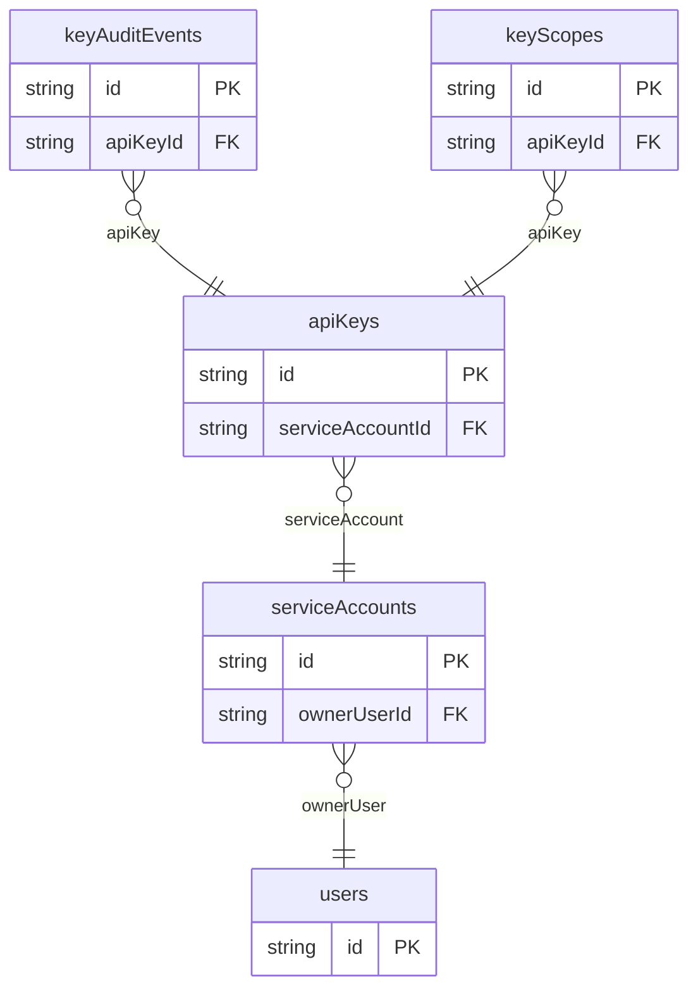

# API Key Login Example

## What This Teaches

Use this when services or integrations authenticate with API keys. The fixtures model users, service accounts, key fingerprints, scopes, and audit events without storing real API keys or bearer tokens.

## Why This Shape?

- `users` own service accounts but do not store machine credentials directly.
- `serviceAccounts` is separate because machine identities can have their own lifecycle and owner.
- `apiKeys` is separate because keys rotate, expire, and revoke independently.
- `keyScopes` and `keyAuditEvents` are separate so authorization grants and usage history can be reviewed.

## Data Model Diagram



## Relations To Notice

- `serviceAccounts.ownerUserId` relates machine identities to `users.id`.
- `apiKeys.serviceAccountId`, `keyScopes.apiKeyId`, and `keyAuditEvents.apiKeyId` connect keys, grants, and audit history.
- REST can use `expand=serviceAccount` on API keys; raw API keys and bearer tokens are intentionally absent.

## Files To Inspect

- [db/users.schema.jsonc](./db/users.schema.jsonc): humans who own service accounts.
- [db/serviceAccounts.schema.jsonc](./db/serviceAccounts.schema.jsonc): machine identities.
- [db/apiKeys.schema.jsonc](./db/apiKeys.schema.jsonc): key metadata, prefixes, and fingerprints only.
- [db/keyScopes.schema.jsonc](./db/keyScopes.schema.jsonc): app-owned scope grants.
- [db/keyAuditEvents.schema.jsonc](./db/keyAuditEvents.schema.jsonc): key use and rotation events.
- [src/render-html.mjs](./src/render-html.mjs): tiny Tailwind CDN API key dashboard using the package API.

## Run It

```bash
node ./src/cli.js sync --cwd ./examples/login-api-keys
node ./examples/login-api-keys/src/render-html.mjs > /tmp/db-login-api-keys.html
node ./src/cli.js serve --cwd ./examples/login-api-keys
```

Try an expanded REST read:

```bash
curl 'http://127.0.0.1:7331/db/api-keys.json?expand=serviceAccount&select=id,label,status,keyPrefix,fingerprint,serviceAccount.name'
```

## Expected Result

Sync creates `apiKeys`, `keyAuditEvents`, `keyScopes`, `serviceAccounts`, and `users` collections. The HTML renderer shows service account ownership, key state, scopes, and audit events.

## Cleanup

Generated `.db/` output is ignored by git.
