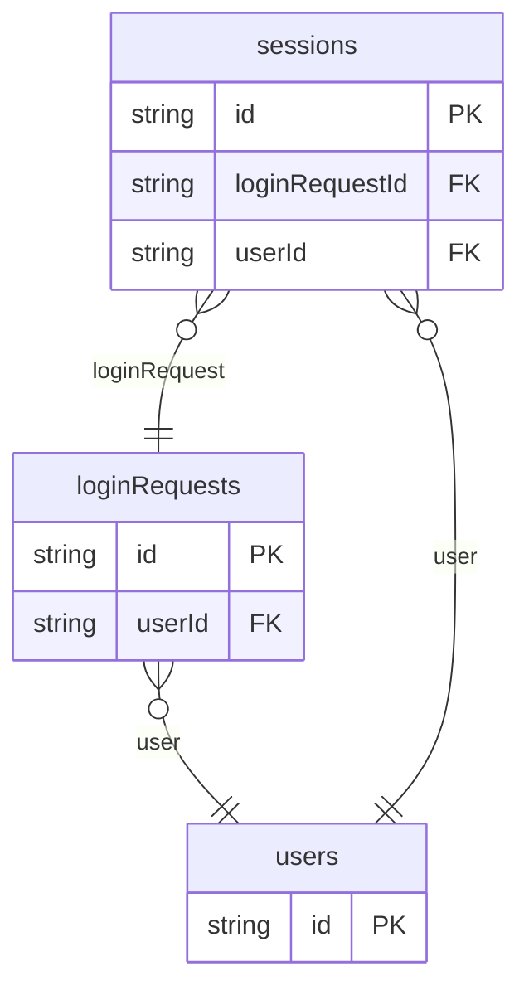

# Magic Link Login Example

## What This Teaches

Use this when a short-lived email link or code proves user ownership of an inbox. The fixtures model request lifecycle and session creation without storing real links, codes, or tokens.

## Why This Shape?

- `users` holds the local account that can receive a login link or code.
- `loginRequests` is separate because each email/code attempt has status, expiry, and delivery metadata.
- `sessions` is separate because an accepted request can create a durable login session.

## Data Model Diagram



## Relations To Notice

- `loginRequests.userId` relates a request to `users.id`, so REST can use `expand=user`.
- `sessions.userId` and `sessions.loginRequestId` connect a session to the user and accepted request.
- Links, codes, and session secrets stay as fingerprints or metadata only; raw secrets are intentionally absent.

## Files To Inspect

- [db/users.schema.jsonc](./db/users.schema.jsonc): passwordless users.
- [db/loginRequests.schema.jsonc](./db/loginRequests.schema.jsonc): request state, delivery channel, and code fingerprints.
- [db/sessions.schema.jsonc](./db/sessions.schema.jsonc): sessions created from accepted requests.
- [src/render-html.mjs](./src/render-html.mjs): tiny Tailwind CDN passwordless login page using the package API.

## Run It

```bash
node ./src/cli.js sync --cwd ./examples/login-magic-link
node ./examples/login-magic-link/src/render-html.mjs > /tmp/db-login-magic-link.html
node ./src/cli.js serve --cwd ./examples/login-magic-link
```

Try an expanded REST read:

```bash
curl 'http://127.0.0.1:7331/db/login-requests.json?expand=user&select=id,status,channel,user.email,expiresAt'
```

## Expected Result

Sync creates `loginRequests`, `sessions`, and `users` collections. The HTML renderer shows pending, accepted, and expired login requests beside resulting sessions.

## Cleanup

Generated `.db/` output is ignored by git.
