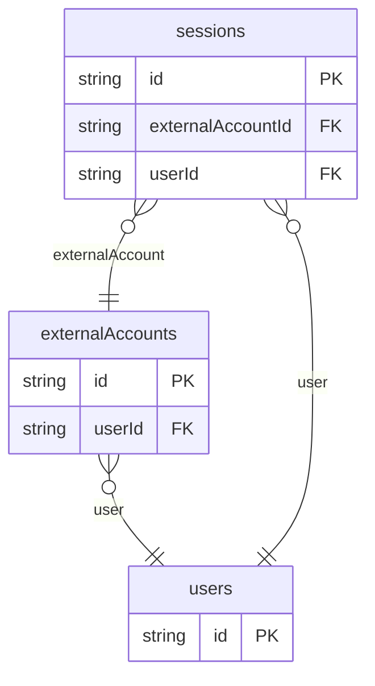

# OAuth Login Example

## What This Teaches

Use this when users sign in through Google, GitHub, or another OAuth/OIDC provider. The fixtures model local users, external account links, provider metadata, and sessions without storing access tokens, refresh tokens, or ID tokens.

## Why This Shape?

- `users` is the local account record your app owns.
- `externalAccounts` is separate because one local user can link multiple providers or provider subjects.
- `sessions` is separate because provider sign-in creates app-owned session records.

## Data Model Diagram



## Relations To Notice

- `externalAccounts.userId` relates provider links to `users.id`, so REST can use `expand=user`.
- `sessions.userId` and `sessions.externalAccountId` connect app sessions to both the local user and provider account.
- Provider access tokens, refresh tokens, and ID tokens are intentionally absent; the example stores only safe metadata.

## Files To Inspect

- [db/users.schema.jsonc](./db/users.schema.jsonc): local user records.
- [db/externalAccounts.schema.jsonc](./db/externalAccounts.schema.jsonc): provider account links and profile metadata.
- [db/sessions.schema.jsonc](./db/sessions.schema.jsonc): sessions created from provider sign-ins.
- [src/render-html.mjs](./src/render-html.mjs): tiny Tailwind CDN OAuth account-linking page using the package API.

## Run It

```bash
node ./src/cli.js sync --cwd ./examples/login-oauth
node ./examples/login-oauth/src/render-html.mjs > /tmp/db-login-oauth.html
node ./src/cli.js serve --cwd ./examples/login-oauth
```

Try an expanded REST read:

```bash
curl 'http://127.0.0.1:7331/db/external-accounts.json?expand=user&select=id,provider,providerSubject,user.email,linkedAt'
```

## Expected Result

Sync creates `externalAccounts`, `sessions`, and `users` collections. The HTML renderer shows provider links, linked users, scopes, and session state.

## Cleanup

Generated `.db/` output is ignored by git.
