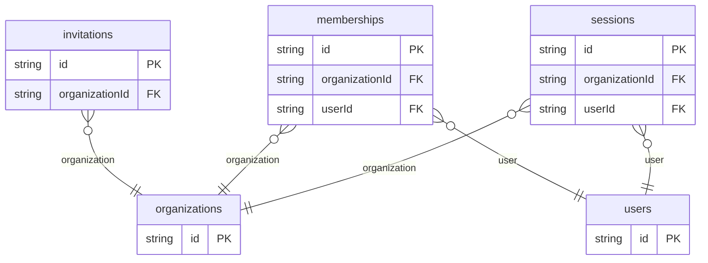

# Organization Login Example

## What This Teaches

Use this when login depends on workspace membership. The fixtures model organizations, users, memberships, invitations, and sessions without auth providers, emails, or background invitation delivery.

## Why This Shape?

- `users` and `organizations` are separate because a person can belong to multiple workspaces.
- `memberships` is the join collection that stores role and membership state.
- `invitations` is separate because invite lifecycle exists before membership is accepted.
- `sessions` is separate because login is scoped to both a user and an organization.

## Data Model Diagram



## Relations To Notice

- `memberships.userId` and `memberships.organizationId` relate users to organizations, so REST can use `expand=user,organization`.
- `sessions.userId` and `sessions.organizationId` connect active login state to the same pair.
- `invitations.organizationId` points at the workspace being joined; invite delivery and token secrets are intentionally out of scope.

## Files To Inspect

- [db/users.schema.jsonc](./db/users.schema.jsonc): people who can join workspaces.
- [db/organizations.schema.jsonc](./db/organizations.schema.jsonc): workspaces.
- [db/memberships.schema.jsonc](./db/memberships.schema.jsonc): roles and membership state.
- [db/invitations.schema.jsonc](./db/invitations.schema.jsonc): pending or accepted workspace invites.
- [db/sessions.schema.jsonc](./db/sessions.schema.jsonc): sessions scoped to an organization.
- [src/render-html.mjs](./src/render-html.mjs): tiny Tailwind CDN organization login page using the package API.

## Run It

```bash
node ./src/cli.js sync --cwd ./examples/login-organization
node ./examples/login-organization/src/render-html.mjs > /tmp/db-login-organization.html
node ./src/cli.js serve --cwd ./examples/login-organization
```

Try an expanded REST read:

```bash
curl 'http://127.0.0.1:7331/db/memberships.json?expand=user,organization&select=id,role,status,user.email,organization.name'
```

## Expected Result

Sync creates `invitations`, `memberships`, `organizations`, `sessions`, and `users` collections. The HTML renderer shows workspace members, pending invites, and org-scoped sessions.

## Cleanup

Generated `.db/` output is ignored by git.
