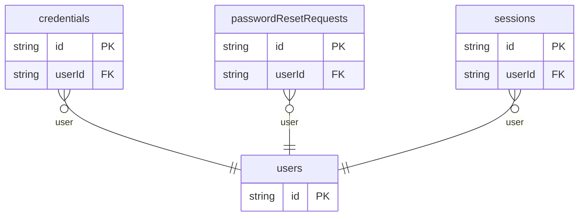

# Password Login Example

## What This Teaches

Use this when an app owns username/password login. The fixtures model user records, credential metadata, sessions, and password reset requests without storing raw passwords, reset tokens, or session secrets.

## Why This Shape?

- `users` holds account identity and status.
- `credentials` is separate because password metadata rotates independently from the user profile.
- `sessions` is separate because each login creates its own lifecycle record.
- `passwordResetRequests` is separate because reset state expires and should not be stored on the user record.

## Data Model Diagram



## Relations To Notice

- `credentials.userId`, `sessions.userId`, and `passwordResetRequests.userId` relate those records to `users.id`.
- REST can use `expand=user` on sessions and reset requests when a UI needs user email beside lifecycle state.
- Token and session values are represented as fingerprints or metadata only; raw secrets are intentionally absent.

## Files To Inspect

- [db/users.schema.jsonc](./db/users.schema.jsonc): login users and account status.
- [db/credentials.schema.jsonc](./db/credentials.schema.jsonc): password hash metadata and fingerprints only.
- [db/sessions.schema.jsonc](./db/sessions.schema.jsonc): active and revoked session records.
- [db/passwordResetRequests.schema.jsonc](./db/passwordResetRequests.schema.jsonc): reset request state with token fingerprints only.
- [src/render-html.mjs](./src/render-html.mjs): tiny Tailwind CDN login status page using the package API.

## Run It

```bash
node ./src/cli.js sync --cwd ./examples/login-password
node ./examples/login-password/src/render-html.mjs > /tmp/db-login-password.html
node ./src/cli.js serve --cwd ./examples/login-password
```

Try an expanded REST read:

```bash
curl 'http://127.0.0.1:7331/db/sessions.json?expand=user&select=id,status,user.email,lastSeenAt'
```

## Expected Result

Sync creates `credentials`, `passwordResetRequests`, `sessions`, and `users` collections. The HTML renderer shows account status, credential freshness, reset requests, and session state.

## Cleanup

Generated `.db/` output is ignored by git.
