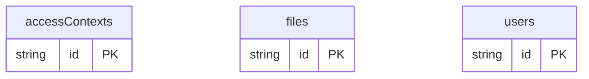

# Permission ABAC Example

## What This Teaches

Attribute-Based Access Control checks attributes on the user, resource, and environment. This example stores users, files, and access contexts in @async/db. The HTML script shows an app-owned decision that considers department, clearance, business hours, and network.

ABAC is usually used for internal tools and enterprise systems where access
depends on context, not just identity or role.

@async/db stores and serves the records. The authorization decision is intentionally owned by the app.

## Why This Shape?

- `users` hold subject attributes such as department and clearance.
- `files` hold resource attributes such as department and sensitivity.
- `accessContexts` hold environment attributes such as network and business-hours state.

## Data Model Diagram



## Relations To Notice

- There are no async/db schema relations in this example; ABAC compares attributes across records at decision time.
- The policy relationship is conceptual: app code evaluates user, file, and environment attributes together.
- async/db stores the inputs and serves them locally, but it does not enforce the ABAC decision.

## Files To Inspect

- [db/users.schema.jsonc](./db/users.schema.jsonc): user attributes such as department and clearance.
- [db/files.schema.jsonc](./db/files.schema.jsonc): resource attributes such as department and sensitivity.
- [db/accessContexts.schema.jsonc](./db/accessContexts.schema.jsonc): environment attributes such as business hours and network.
- [src/render-html.mjs](./src/render-html.mjs): a tiny Tailwind CDN HTML renderer with one allowed and one denied action.

## Run It

```bash
node ./src/cli.js sync --cwd ./examples/permission-abac
node ./examples/permission-abac/src/render-html.mjs
node ./src/cli.js serve --cwd ./examples/permission-abac
```

## Expected Result

The generated HTML shows a finance manager can read a finance budget during business hours, while an engineer cannot read that finance file. The viewer exposes `accessContexts`, `files`, and `users` resources for inspection.

## Cleanup

Generated `.db/` output is ignored by git.
