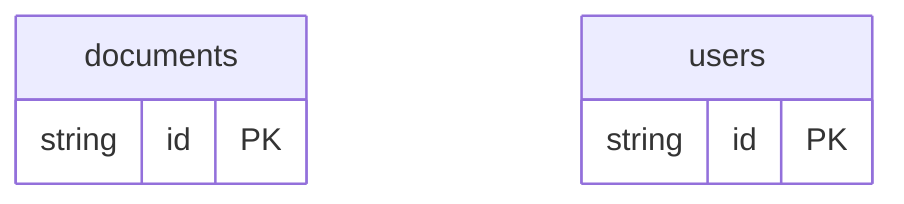

# Permission ACL Example

## What This Teaches

Access Control Lists attach grants directly to a resource. This example stores users and documents where each document has an `acl` array. The HTML script checks the current user's ACL entry before showing whether a write action is allowed.

ACLs are usually used for simple document, folder, or object sharing where the
resource carries its own allow list.

@async/db stores and serves the records. The authorization decision is intentionally owned by the app.

## Why This Shape?

- `documents` carry their own `acl` array because ACL permissions are resource-local.
- `users` are separate so ACL entries can point at reusable people.
- ACL entries stay nested because a small sharing UI usually edits grants with the document.

## Data Model Diagram



## Relations To Notice

- `documents.acl[].userId` is relation metadata to `users.id`, so each grant can point at a user.
- The ACL allow/deny relationship is app policy, not async/db enforcement.
- async/db stores the nested grants and related users; the HTML script interprets them.

## Files To Inspect

- [db/documents.schema.jsonc](./db/documents.schema.jsonc): documents with resource-local ACL entries.
- [db/users.schema.jsonc](./db/users.schema.jsonc): users referenced by ACL entries.
- [src/render-html.mjs](./src/render-html.mjs): a tiny Tailwind CDN HTML renderer with one allowed and one denied action.

## Run It

```bash
node ./src/cli.js sync --cwd ./examples/permission-acl
node ./examples/permission-acl/src/render-html.mjs
node ./src/cli.js serve --cwd ./examples/permission-acl
```

## Expected Result

The generated HTML shows the owner can write the budget worksheet while a read-only user cannot. The viewer exposes `documents` and `users` resources for inspection.

## Cleanup

Generated `.db/` output is ignored by git.
