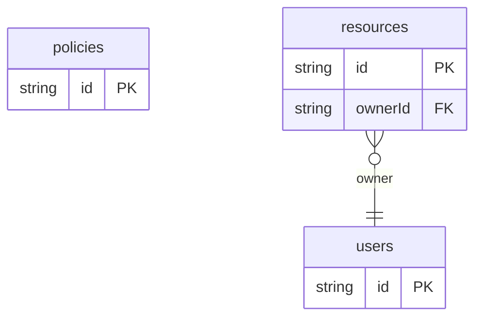

# Permission PBAC Example

## What This Teaches

Policy-Based Access Control evaluates centralized policy records instead of spreading every rule across individual resources. This example stores users, resources, and policies in @async/db. The HTML script interprets those policy records to decide whether an action is allowed.

PBAC is usually used when rules need to be centralized, reviewed, versioned, or
shared across several resources and actions.

@async/db stores and serves the records. The authorization decision is intentionally owned by the app.

## Why This Shape?

- `policies` are top-level records because centralized rules need review and versioning.
- `resources` are separate from policies because many policies can apply to the same protected object.
- `users` hold attributes that policy conditions can evaluate.

## Data Model Diagram



## Relations To Notice

- `resources.ownerId` is an async/db relation to `users.id`.
- Policy condition fields are app-owned data, not async/db relation metadata, because the PBAC evaluator interprets them.
- async/db serves policies, resources, and users; app code decides which policy applies.

## Files To Inspect

- [db/policies.schema.jsonc](./db/policies.schema.jsonc): central allow and deny policy records.
- [db/resources.schema.jsonc](./db/resources.schema.jsonc): resources evaluated by those policies.
- [db/users.schema.jsonc](./db/users.schema.jsonc): users with policy-facing attributes.
- [src/render-html.mjs](./src/render-html.mjs): a tiny Tailwind CDN HTML renderer with one allowed and one denied action.

## Run It

```bash
node ./src/cli.js sync --cwd ./examples/permission-pbac
node ./examples/permission-pbac/src/render-html.mjs
node ./src/cli.js serve --cwd ./examples/permission-pbac
```

## Expected Result

The generated HTML shows an editor can publish a draft article while a viewer cannot. The viewer exposes `policies`, `resources`, and `users` resources for inspection.

## Cleanup

Generated `.db/` output is ignored by git.
