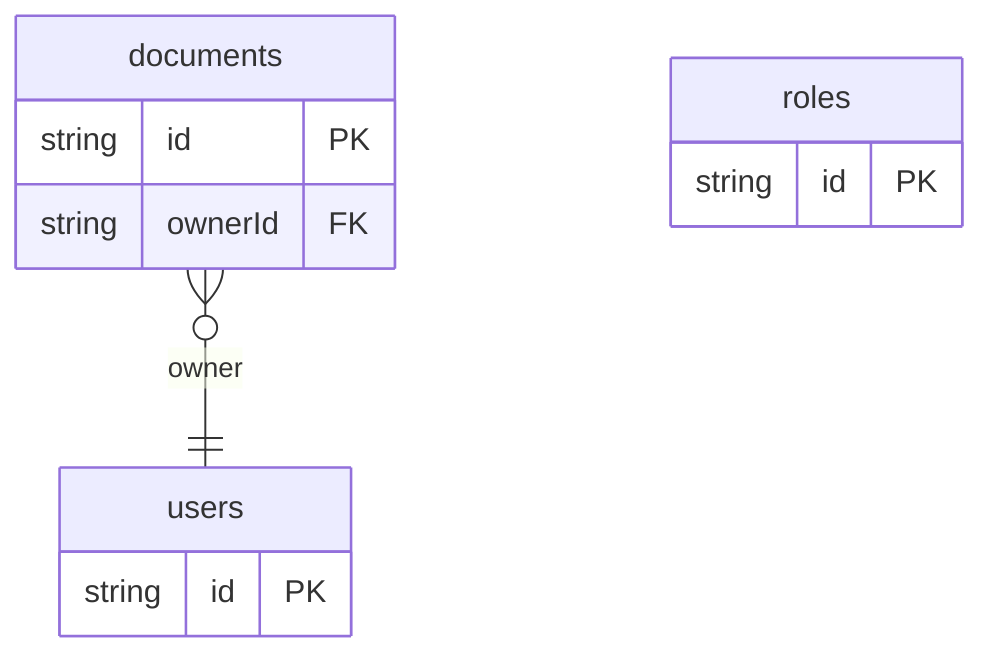

# Permission RBAC Example

## What This Teaches

Role-Based Access Control assigns permissions to roles, then assigns users to those roles. This example stores users, roles, role permission keys, and documents in @async/db. The HTML script shows how app code can make a simple allow/deny decision from that data.

RBAC is usually the default fit for web apps with clear roles such as admin,
editor, moderator, and viewer.

@async/db stores and serves the records. The authorization decision is intentionally owned by the app.

## Why This Shape?

- `users` carry assigned `roleIds` because a user can have one or more roles.
- `roles` hold permission keys so permissions can be reviewed and reused without rewriting users.
- `documents` are protected resources and include an owner for display and ownership checks.

## Data Model Diagram



## Relations To Notice

- `documents.ownerId` is an async/db relation to `users.id`, so owner records can be expanded.
- `users.roleIds` are app-owned plain ids, not async/db relation metadata, because the RBAC decision code interprets roles and permission keys.
- RBAC policy meaning is app-owned; async/db only stores `users`, `roles`, and `documents`.

## Files To Inspect

- [db/users.schema.jsonc](./db/users.schema.jsonc): users with assigned `roleIds`.
- [db/roles.schema.jsonc](./db/roles.schema.jsonc): roles with permission keys such as `documents:edit`.
- [db/documents.schema.jsonc](./db/documents.schema.jsonc): documents protected by role permissions.
- [src/render-html.mjs](./src/render-html.mjs): a tiny Tailwind CDN HTML renderer with one allowed and one denied action.

## Run It

```bash
node ./src/cli.js sync --cwd ./examples/permission-rbac
node ./examples/permission-rbac/src/render-html.mjs
node ./src/cli.js serve --cwd ./examples/permission-rbac
```

## Expected Result

The generated HTML includes an allowed admin delete decision and a denied viewer edit decision. The viewer exposes `documents`, `roles`, and `users` resources for inspection.

## Cleanup

Generated `.db/` output is ignored by git.
