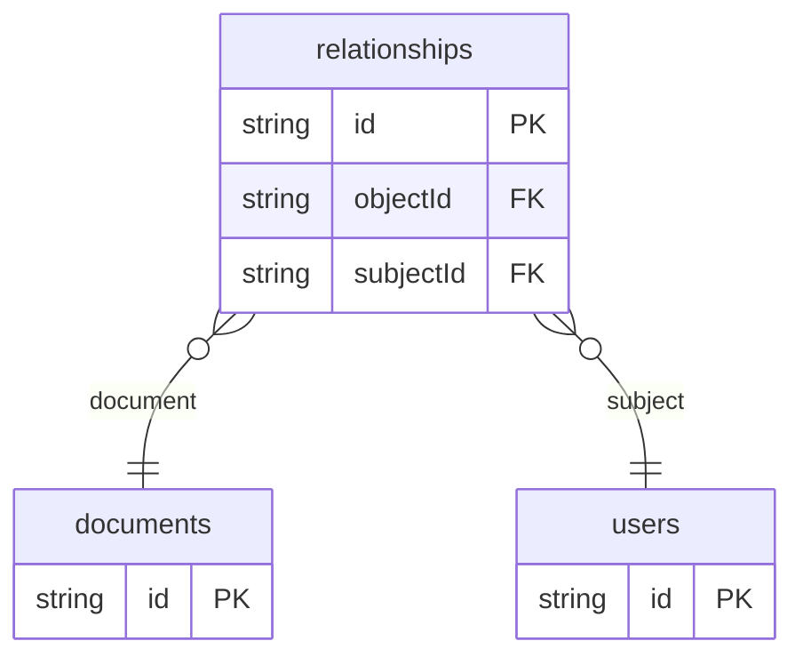

# Permission ReBAC Example

## What This Teaches

Relationship-Based Access Control checks how two entities are related. This example stores users, documents, and relationship tuples such as `user -> owner -> document`. The HTML script allows editing when the user is an owner or editor of that document.

ReBAC is usually used for social graphs, organizations, nested folders, team
membership, and document sharing where relationships are the policy input.

@async/db stores and serves the records. The authorization decision is intentionally owned by the app.

## Why This Shape?

- `relationships` is a tuple collection because ReBAC policy is about subject-relation-object facts.
- `users` are tuple subjects, while `documents` are protected objects in this small example.
- Relationship tuples are separate from documents so sharing can change without rewriting the document record.

## Data Model Diagram



## Relations To Notice

- `relationships.subjectId` relates to `users.id` and `relationships.objectId` relates to `documents.id` in this example.
- The tuple `relation` value such as `owner`, `editor`, or `viewer` is policy data, not async/db enforcement.
- async/db can store and expand related records, while app code interprets whether a relationship grants access.

## Files To Inspect

- [db/relationships.schema.jsonc](./db/relationships.schema.jsonc): tuple-shaped relationship records.
- [db/documents.schema.jsonc](./db/documents.schema.jsonc): resources being protected.
- [db/users.schema.jsonc](./db/users.schema.jsonc): users that appear as tuple subjects.
- [src/render-html.mjs](./src/render-html.mjs): a tiny Tailwind CDN HTML renderer with one allowed and one denied action.

## Run It

```bash
node ./src/cli.js sync --cwd ./examples/permission-rebac
node ./examples/permission-rebac/src/render-html.mjs
node ./src/cli.js serve --cwd ./examples/permission-rebac
```

## Expected Result

The generated HTML shows an owner can edit the roadmap while a viewer cannot edit that same document. The viewer exposes `documents`, `relationships`, and `users` resources for inspection.

## Cleanup

Generated `.db/` output is ignored by git.
