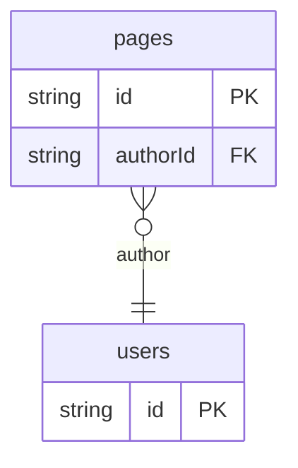

# Recursive Schema UI Example

## What This Teaches

Use this after [Schema UI](../schema-ui/README.md). It treats the schema manifest as a recursive model tree, then layers this app's own `schemaUi` metadata on top for presentation choices.

async/db keeps every model live. This example chooses what to show: `schemaUi.hidden` hides a resource from this UI only, while the resource remains in the manifest, generated types, runtime state, REST, and GraphQL.

`schemaUi` is not a reserved async/db feature. async/db preserves custom manifest keys, but it does not interpret this namespace.

## Why This Shape?

- `pages` includes nested `blocks` so the UI can demonstrate object and array fields, not just flat scalar fields.
- `users` is separate because page authors are reusable records, but this app hides that resource from its own navigation.
- The committed manifest remains the source of model metadata, while runtime records still come from the async/db API.
- Existing blocks stay nested because this example edits them as part of a page record.

## Data Model Diagram



## Relations To Notice

- `pages.authorId` relates to `users.id`, so relation controls can resolve and display author choices.
- `schemaUi.hidden` hides users from this UI only; the relation target still exists in the manifest, REST, and GraphQL.
- Nested block fields are not separate relations. They are object and array fields walked by the example renderer.

## What Is Recursive?

The recursive part is the example-side model walker in [src/cms-ssr.mjs](./src/cms-ssr.mjs). It starts at a collection, visits each field, and calls itself again when a field contains more model information.

```txt
pages collection
+-- fields.title: string
+-- fields.status: enum
+-- fields.authorId: relation -> users
+-- fields.blocks: array
    +-- items: object
        +-- fields.kind: enum
        +-- fields.title: string
        +-- fields.bodyMarkdown: string
        +-- fields.settings: object
            +-- fields.color: string
            +-- fields.featured: boolean
```

The data model is recursive in the same practical sense: a page has `blocks`, each block is an object, and each block can contain another object at `settings`. The form renderer follows that nested model tree and names controls with JSON Pointer paths:

```txt
/title
/blocks/0/title
/blocks/0/settings/color
/blocks/0/settings/featured
```

This is not a hard-coded page editor. The app code is repeatedly applying the same field rules to scalar fields, object fields, and array item fields.

## Files To Inspect

- [db/pages.schema.jsonc](./db/pages.schema.jsonc): page schema with nested `blocks` array and object fields.
- [db/users.schema.jsonc](./db/users.schema.jsonc): author records used by relation selectors; hidden from this UI with app-owned `schemaUi.hidden`.
- [db.config.mjs](./db.config.mjs): writes the schema manifest and attaches this example's `schemaUi` metadata.
- [src/cms-ssr.mjs](./src/cms-ssr.mjs): recursive model walker, view renderer, edit form renderer, JSON Pointer form parser, and save helper.
- [src/schema-ui-ssr-handler.mjs](./src/schema-ui-ssr-handler.mjs): SSR routing layer; handles edit form posts and hands off other paths to db.
- [src/start-schema-ui-server.mjs](./src/start-schema-ui-server.mjs): wires SSR handler, `createDbRequestHandler`, and file watching.
- [src/render-admin.mjs](./src/render-admin.mjs): static recursive template preview (`/templates`) and CLI output.
- [src/generated/db.schema.json](./src/generated/db.schema.json): committed manifest input after sync.

## Pattern

The recursive renderer reads model facts from async/db:

- scalar controls from `type`
- enum controls from `values`
- relation controls from `relation`
- nested object controls from `fields`
- array item controls from `items`
- id/read-only behavior from `idField` and field metadata

The app-owned `schemaUi` namespace adds presentation conventions:

- `schemaUi.hidden` hides a resource or field from this example UI only
- `schemaUi.title`, `schemaUi.description`, and `schemaUi.listLabelField` shape labels
- `schemaUi.component` chooses example renderers such as `markdown`, `segmented-control`, and `object-array`

Form input names are JSON Pointer paths, such as `/title`, `/blocks/0/title`, and `/blocks/0/settings/color`. Form submit parses those paths into a nested patch object and updates the existing record through the package API.

Existing array items can be edited by index. Adding, removing, and reordering array items are intentionally out of scope.

## Run It

From the repository root:

```bash
node ./examples/recursive-schema-ui/serve.mjs
```

Open `http://127.0.0.1:7342/`. The built-in viewer is `http://127.0.0.1:7342/__db`.

### From The Repo Examples Index

```bash
npm run examples
```

Pick **Recursive Schema UI** on the index page; it uses `serve-example.mjs` automatically.

Routes:

| Path | Purpose |
| --- | --- |
| `/` | Home: visible collections and record counts |
| `/cms/pages` | List visible page records |
| `/cms/pages/page_home` | Recursive detail page with nested view and edit controls |
| `/templates` | Static recursive templates only, no database rows |
| `/__db`, `/graphql`, `/db/pages.json`, ... | Stock db viewer, GraphQL, and REST on the same origin |

Options:

```bash
node ./examples/recursive-schema-ui/serve.mjs --port 8080 --host 127.0.0.1
node ./examples/recursive-schema-ui/serve.mjs --no-sync
```

`--no-sync` skips fixture sync on startup. Use it only after `.db/state` already exists.

### Print Static Templates To A File

```bash
node ./src/cli.js sync --cwd ./examples/recursive-schema-ui
node ./examples/recursive-schema-ui/src/render-admin.mjs > /tmp/db-recursive-schema-ui.html
```

## Expected Result

The home page lists `pages` but not `users`. The `users` collection is still present in the committed manifest and runtime API.

The page detail form renders scalar, enum, relation, object, and array controls. Saving updates the existing runtime mirror record. It does not create records or add, remove, or reorder array items.

## Cleanup

Generated `.db/` output is ignored by git. The files under `src/generated/` are intentionally committed for this example.

## More Docs

- [Generated Files](../../docs/generated-files.md)
- [Configuration](../../docs/configuration.md)
