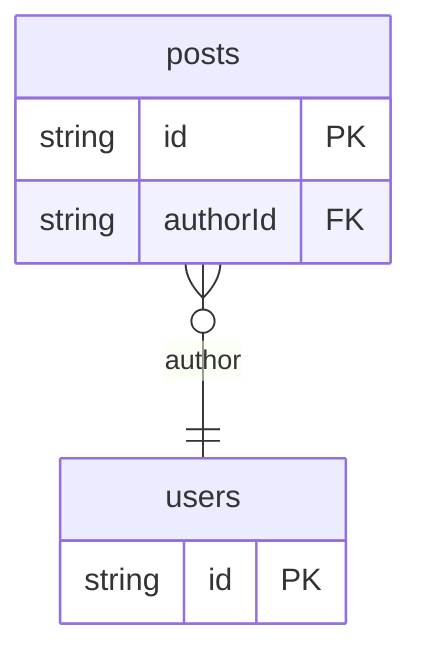

# Relations Example

## What This Teaches

Use this when local fixtures need related records but you still want plain ids in JSON. It demonstrates to-one relation metadata, explicit REST `expand`, and nested `select`.

## Why This Shape?

- `posts` and `users` are separate because many posts can share one author.
- The post record stores `authorId` as a plain scalar id so source data stays simple.
- The schema adds relation metadata so async/db knows how to resolve that id when requested.

## Data Model Diagram



## Relations To Notice

- `posts.authorId` relates to `users.id` and exposes the relation name `author`.
- REST expansion is explicit: use `expand=author` before selecting `author.name`.
- Relation expansion is intentionally depth 1 in this version.

## Files To Inspect

- [db/users.schema.jsonc](./db/users.schema.jsonc): target collection.
- [db/posts.schema.jsonc](./db/posts.schema.jsonc): `authorId` declares a relation to `users.id`.
- [db.config.mjs](./db.config.mjs): default mirror setup using `defineConfig`.

## Run It

From the repository root, use the repo-internal CLI path:

```bash
node ./src/cli.js sync --cwd ./examples/relations
node ./src/cli.js serve --cwd ./examples/relations
```

Open the viewer:

```txt
http://127.0.0.1:7331/__db
```

## Expected Result

The viewer lists `posts` and `users`. The posts schema shows an `author` relation derived from `authorId`.

## REST Request To Try

Leave `serve` running and run this from another terminal:

```bash
curl 'http://127.0.0.1:7331/db/posts.json?expand=author&select=id,title,author.name'
```

Relation expansion is intentionally explicit and depth 1 in this version.

## Features To Notice

- [Relationship expansion](../../docs/server-and-viewer.md#relationship-expansion)
- [Nested `select` fields](../../docs/server-and-viewer.md#rest-routes)
- [Schema relation metadata](../../docs/fixtures-and-schemas.md#schema-files)
- [Fixture-like `.json` REST routes](../../docs/server-and-viewer.md#fixture-like-json-routes)

## Cleanup

Generated `.db/` output is ignored by git and can be removed whenever you want a fresh mirror.

## More Docs

- [Fixtures And Schemas](../../docs/fixtures-and-schemas.md)
- [Server And Viewer](../../docs/server-and-viewer.md)
