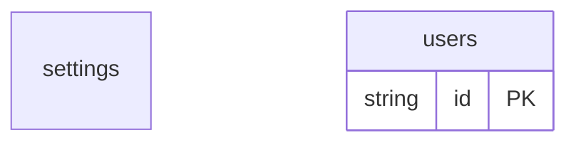

# REST Client Example

## What This Teaches

Use this when you want to call db from app or test code instead of typing `curl` commands. It demonstrates `createDbClient()`, direct REST calls, and a REST batch request.

## Why This Shape?

- `users` is a schema-backed collection so client reads and writes have a small contract to target.
- `settings` is a singleton document so the client demo shows both collection and document routes.
- The demo script is separate from fixtures because it represents app or test code consuming REST.
- There are no cross-resource relations in this example; it focuses on direct reads and REST batching rather than expansion.

## Data Model Diagram



## Relations To Notice

There are no schema-declared relations in this example; each resource can be inspected independently.

## Files To Inspect

- [db/users.schema.jsonc](./db/users.schema.jsonc): schema-backed collection with defaults and unique email validation.
- [db/settings.json](./db/settings.json): singleton document inferred from data.
- [src/client-demo.mjs](./src/client-demo.mjs): tiny consumer script using `@async/db/client`.

## Run It

From the repository root, use the repo-internal CLI path:

```bash
node ./src/cli.js sync --cwd ./examples/rest-client
node ./src/cli.js serve --cwd ./examples/rest-client
```

In another terminal:

```bash
ASYNC_DB_URL=http://127.0.0.1:7331 node ./examples/rest-client/src/client-demo.mjs
```

## Expected Result

`sync` writes generated schema, types, and runtime state under `examples/rest-client/.db/`. The demo script prints users from `/db/users.json`, settings from `/db/settings.json`, and a two-item batch result.

## REST Request To Try

Leave `serve` running and run this from another terminal:

```bash
curl 'http://127.0.0.1:7331/db/users.json?select=id,name,email'
```

## Features To Notice

- [HTTP client operations](../../docs/package-api.md#http-client)
- [Fixture-like `.json` REST routes](../../docs/server-and-viewer.md#fixture-like-json-routes)
- [REST batching](../../docs/server-and-viewer.md#rest-batching)
- [Schema-backed fixtures](../../docs/fixtures-and-schemas.md#schema-files)

## Cleanup

Generated `.db/` output is ignored by git and can be removed whenever you want a fresh mirror.

## More Docs

- [Package API](../../docs/package-api.md)
- [Server And Viewer](../../docs/server-and-viewer.md)
