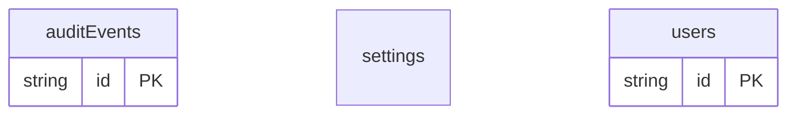

# Schema-First Example

## What This Teaches

Use this when you know the local contract before you have real records. It defines resources with `.schema.jsonc`, including a type-only collection with no seed records.

## Why This Shape?

- `users` shows a schema-backed collection with seed records when the contract and starter data are both known.
- `settings` is a singleton document because there is only one settings record.
- `auditEvents` is schema-only so generated types and empty runtime state exist before any events are written.
- There are no cross-resource relations in this example; the point is defining resources before or alongside seed data.

## Data Model Diagram



## Relations To Notice

There are no schema-declared relations in this example; each resource can be inspected independently.

## Files To Inspect

- [db/users.schema.jsonc](./db/users.schema.jsonc): collection with seed data.
- [db/settings.schema.jsonc](./db/settings.schema.jsonc): singleton document schema.
- [db/auditEvents.schema.jsonc](./db/auditEvents.schema.jsonc): schema-only collection with an empty runtime state.
- [src/generated/db.types.ts](./src/generated/db.types.ts): committed generated types.

## Run It

From the repository root, use the repo-internal CLI path:

```bash
node ./src/cli.js sync --cwd ./examples/schema-first
node ./src/cli.js serve --cwd ./examples/schema-first
```

Open the viewer:

```txt
http://127.0.0.1:7331/__db
```

## Expected Result

`sync` initializes empty runtime state for schema-only resources and writes committed generated types.

## REST Request To Try

Leave `serve` running and run this from another terminal:

```bash
curl http://127.0.0.1:7331/db/audit-events.json
```

## Features To Notice

- [Schema-first resources](../../docs/concepts.md#schema-first)
- [Schema files](../../docs/fixtures-and-schemas.md#schema-files)
- [Generated types](../../docs/generated-files.md#generated-types)
- [Fixture-like `.json` REST routes](../../docs/server-and-viewer.md#fixture-like-json-routes)

## Cleanup

Generated `.db/` output is ignored by git and can be removed whenever you want a fresh mirror.

## More Docs

- [Concepts](../../docs/concepts.md)
- [Fixtures And Schemas](../../docs/fixtures-and-schemas.md)
