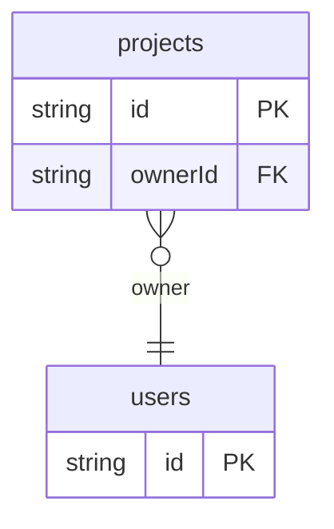

# Schema Manifest Example

## What This Teaches

Use this when an app wants committed model metadata for custom admin, docs, or form-building screens. It demonstrates `outputs.schemaManifest` and `schemaManifest.customizeField()`.

## Why This Shape?

- `projects` is a schema-backed collection with enum status and owner relation metadata that a custom UI can read.
- `users` is separate because owners are reusable records and user fields can carry their own display metadata.
- The committed manifest is separate generated output so app code can import model metadata without starting the dev server.
- `schemaUi` keys are app-owned metadata preserved by async/db, not core schema behavior.

## Data Model Diagram



## Relations To Notice

- `projects.ownerId` relates to `users.id`, so REST can use `expand=owner`.
- The schema manifest includes the relation metadata so a custom UI can render owner links or selects.
- Manifest customization adds presentation metadata only; records still live behind REST or GraphQL routes.

## Files To Inspect

- [db/projects.schema.jsonc](./db/projects.schema.jsonc): relation, enum, defaults, and descriptions.
- [db/users.schema.jsonc](./db/users.schema.jsonc): field descriptions and a `bio` field customized for markdown.
- [db.config.mjs](./db.config.mjs): writes `src/generated/db.schema.json` and attaches app-owned `schemaUi` metadata.
- [src/generated/db.schema.json](./src/generated/db.schema.json): committed manifest output after sync.

## Run It

From the repository root, use the repo-internal CLI path:

```bash
node ./src/cli.js sync --cwd ./examples/schema-manifest
node ./src/cli.js schema manifest --cwd ./examples/schema-manifest --out ./src/generated/db.schema.json
node ./src/cli.js serve --cwd ./examples/schema-manifest
```

## Expected Result

`sync` writes both generated TypeScript types and a committed schema manifest. In the manifest, `projects.status.schemaUi.component` is `segmented-control`, and `users.bio.schemaUi.component` is `markdown`. async/db preserves those keys but does not interpret them.

## REST Request To Try

Leave `serve` running and run this from another terminal:

```bash
curl 'http://127.0.0.1:7331/db/projects.json?expand=owner&select=id,name,status,owner.name'
```

## Features To Notice

- [Schema manifest output](../../docs/generated-files.md#schema-manifest-output)
- [App-owned manifest metadata](../../docs/server-and-viewer.md#custom-viewer-manifest)
- [Relationship expansion](../../docs/server-and-viewer.md#relationship-expansion)
- [Fixture-like `.json` REST routes](../../docs/server-and-viewer.md#fixture-like-json-routes)

## Cleanup

Generated `.db/` output is ignored by git. The files under `src/generated/` are intentionally committed for this example.

## More Docs

- [Generated Files](../../docs/generated-files.md)
- [Configuration](../../docs/configuration.md)
