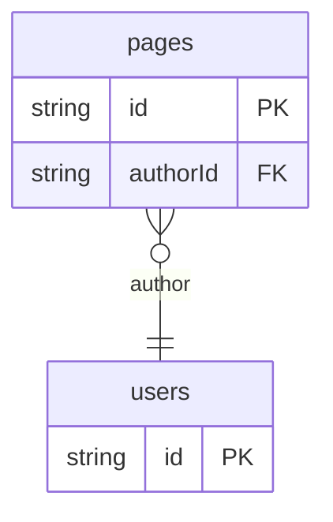

# Schema UI Example

## What This Teaches

Use this as the first small UI step after the schema manifest example. It reads `src/generated/db.schema.json` and maps flat resource fields to simple view and editor HTML.

async/db provides model facts such as `type`, `values`, `required`, and `relation`. This example adds its own `schemaUi` metadata in `db.config.mjs` for presentation choices such as labels and components. `schemaUi` is not a reserved async/db feature; it is just a namespace this example uses.

The demo composes SSR CMS routes ahead of the stock db handler, so the same port serves `/` SSR, `/__db`, REST, and GraphQL.

## Why This Shape?

- `pages` is a flat CMS collection so the first UI example can map fields directly to view and edit controls.
- `users` is separate because page authors are reusable records.
- The committed manifest is the model input for the UI; runtime records still come from the async/db API.
- The SSR layer is example-owned app code mounted beside the stock viewer and REST routes.

## Data Model Diagram



## Relations To Notice

- `pages.authorId` relates to `users.id`, so REST can use `expand=author`.
- The manifest exposes relation metadata so the UI can render author links and select options.
- This flat UI does not walk nested arrays; nested model rendering is saved for the recursive example.

## Files To Inspect

- [db/pages.schema.jsonc](./db/pages.schema.jsonc): flat CMS page schema with enum, relation, summary, and markdown body fields.
- [db/users.schema.jsonc](./db/users.schema.jsonc): author records used by relation links and selects.
- [db.config.mjs](./db.config.mjs): writes the schema manifest and attaches app-owned `schemaUi` hints.
- [src/render-admin.mjs](./src/render-admin.mjs): static string-template preview (`/templates`) and CLI output for scaffolding comparisons.
- [src/cms-ssr.mjs](./src/cms-ssr.mjs): SSR view/editor snippets filled with real record values and resolved relations.
- [src/schema-ui-ssr-handler.mjs](./src/schema-ui-ssr-handler.mjs): SSR routing layer; hands off other paths to db.
- [src/start-schema-ui-server.mjs](./src/start-schema-ui-server.mjs): wires SSR handler, `createDbRequestHandler`, and file watching.
- [serve.mjs](./serve.mjs): CLI entry for running the local schema UI server.
- [serve-example.mjs](./serve-example.mjs): `npm run examples` hook.
- [src/generated/db.schema.json](./src/generated/db.schema.json): committed manifest input after sync.

## Run It

From the repository root:

```bash
node ./examples/schema-ui/serve.mjs
```

Open `http://127.0.0.1:7342/`. The built-in viewer is `http://127.0.0.1:7342/__db`.

### From The Repo Examples Index

```bash
npm run examples
```

Pick **Schema UI** on the index page; it uses `serve-example.mjs` automatically.

Routes:

| Path | Purpose |
| --- | --- |
| `/` | Home: collections and record counts |
| `/cms/pages` | List pages from the mirror |
| `/cms/pages/page_home` | SSR detail: resolved author link, markdown body text, filled editor controls |
| `/templates` | Static component templates only, no database rows |
| `/__db`, `/graphql`, `/db/pages.json`, ... | Stock db viewer, GraphQL, and REST on the same origin |

Options:

```bash
node ./examples/schema-ui/serve.mjs --port 8080 --host 127.0.0.1
node ./examples/schema-ui/serve.mjs --no-sync
```

`--no-sync` skips fixture sync on startup. Use it only after `.db/state` already exists.

### Print Static Templates To A File

```bash
node ./src/cli.js sync --cwd ./examples/schema-ui
node ./examples/schema-ui/src/render-admin.mjs > /tmp/db-schema-ui.html
```

## Expected Result

SSR pages show live field values: titles, markdown bodies escaped into `<article>`, relation links to `/cms/users/:id`, radios reflecting enum status, and selects populated from related rows.

This example only renders markup. It does not hide resources, walk nested arrays, or persist edits. See [Recursive Schema UI](../recursive-schema-ui/README.md) for that next step.

## REST Request To Try

With `serve.mjs` or `npm run examples`:

```bash
curl 'http://127.0.0.1:7342/db/pages.json?expand=author&select=id,title,status,author.name'
```

## Features To Notice

- [Schema manifest output](../../docs/generated-files.md#schema-manifest-output)
- [Custom viewer manifest](../../docs/server-and-viewer.md#custom-viewer-manifest)
- [Relationship expansion](../../docs/server-and-viewer.md#relationship-expansion)
- [Fixture-like `.json` REST routes](../../docs/server-and-viewer.md#fixture-like-json-routes)

## Cleanup

Generated `.db/` output is ignored by git. The files under `src/generated/` are intentionally committed for this example.

## More Docs

- [Generated Files](../../docs/generated-files.md)
- [Configuration](../../docs/configuration.md)
